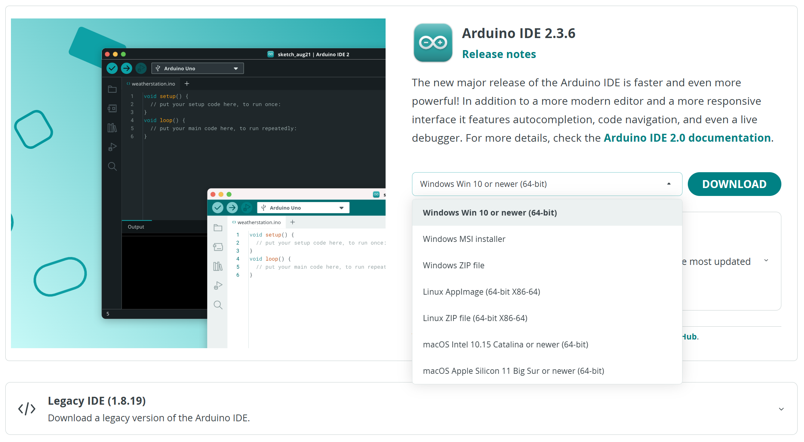
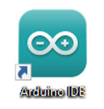
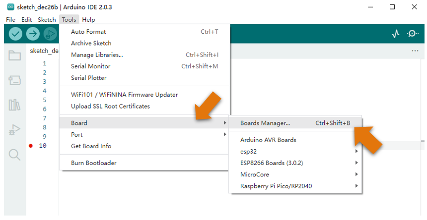
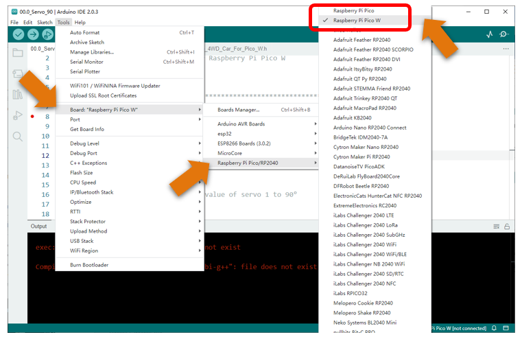
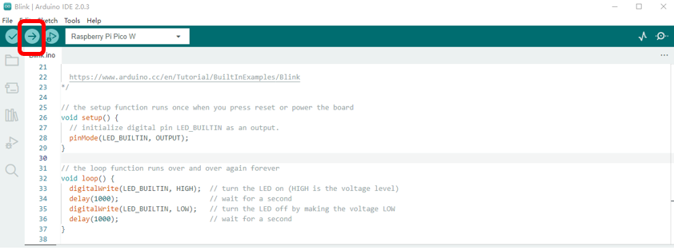
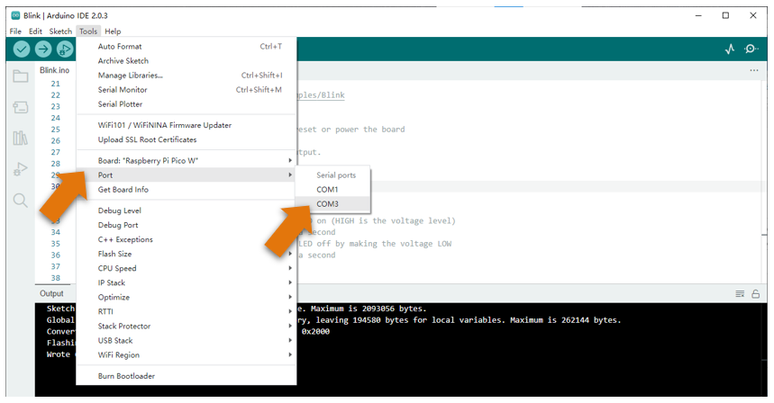

##############################################################################
Chapter 0 Installation of Arduino IDE
##############################################################################

Arduino Software
*******************************

Arduino Software (IDE) is used to write and upload the code for Arduino Board.

First, install Arduino Software (IDE): visit https://www.arduino.cc/en/software/

Select and download corresponding installer based on your operating system. If you are a Windows user, please select the "Windows" to download and install the driver correctly.

.. image:: ../_static/imgs/Standard/ArduinoIDE/Preface04.png
    :align: center

After the downloading completes, run the installer. For Windows users, there may pop up an installation dialog box of driver during the installation process. When it is popped up, please allow the installation.

After installation is completed, an shortcut will be generated in the desktop.

Run it. The interface of the software is as follows:

.. image:: ../_static/imgs/Standard/ArduinoIDE/Preface06.png
    :align: center

Programs written with Arduino IDE are called sketches. These sketches are written in a text editor and are saved with the file extension.ino. The editor has features for cutting/pasting and for searching/replacing text. The console displays text output by the Arduino IDE, including complete error messages and other information. The bottom right-hand corner of the window displays the configured board and serial port. The toolbar buttons allow you to verify and upload programs, open the serial monitor, and access the serial plotter.

.. table::
    :align: center
    :class: table-line
    :width: 80%
    
    +-------------+---------------------------------------------------------------------+
    | |Arduino07| | Verify                                                              |
    |             |                                                                     |
    |             | Checks your code for errors compiling it.                           |
    +-------------+---------------------------------------------------------------------+
    | |Arduino08| | Upload                                                              |
    |             |                                                                     |
    |             | Compiles your code and uploads it to the configured board.          |
    +-------------+---------------------------------------------------------------------+
    | |Arduino09| | Debug                                                               |
    |             |                                                                     |
    |             | Troubleshoot code errors and monitor program running status.        |
    +-------------+---------------------------------------------------------------------+
    | |Arduino10| | Serial Plotter                                                      |
    |             |                                                                     |
    |             | Real-time plotting of serial port data charts.                      |
    +-------------+---------------------------------------------------------------------+
    | |Arduino11| | Serial Monitor                                                      |
    |             |                                                                     |
    |             | Used for debugging and communication between devices and computers. |
    +-------------+---------------------------------------------------------------------+

.. |Arduino07| image:: ../_static/imgs/Standard/ArduinoIDE/Preface07.png
.. |Arduino08| image:: ../_static/imgs/Standard/ArduinoIDE/Preface08.png
.. |Arduino09| image:: ../_static/imgs/Standard/ArduinoIDE/Preface09.png
.. |Arduino10| image:: ../_static/imgs/Standard/ArduinoIDE/Preface10.png
.. |Arduino11| image:: ../_static/imgs/Standard/ArduinoIDE/Preface11.png

Environment Configuration
*****************************************

First, open the software platform arduino, and then click File in Menus and select Preferences.

Second, click on the symbol behind "Additional Boards Manager URLs" 

Third, fill in 

https://github.com/earlephilhower/arduino-pico/releases/download/global/package_rp2040_index.json 

in the new window, click OK, and click OK on the Preferences window again.

Fourth, click Tools in Menus, select Board:"ArduinoUno", and then select "Boards Manager".

Fifth, input "Pico" in the window below, and press Enter. click "Install" to install.

When finishing installation, click Tools in the Menus again and select Board: "Raspberry Pi Pico/RP2040", and then you can see information of Raspberry Pi Pico (W). Click "Raspberry Pi Pico W" so that the Raspberry Pi Pico W programming development environment is configured.

Additional Remarks
**********************************

To finish this tutorial, you can use a Raspberry Pi Pico W or a Raspberry Pi Pico. The two boards have the same form factor, and their only difference is that Pico W features with an onboard single-band 4.802GHz wireless interface using Infineon CYW2. That is to say, the hardware Raspberry Pi Pico W is almost the same as the normal pico except for the wireless interface, which enables Pico W to work with WiFi (see chapter 7). If you use a normal Pico, you will not be able to finish the experiments in chapter 7. You can just skip that chapter.

No matter which board you use, the procedure for each project is the same. You only need to select the correct board and upload the corresponding code based on the board you use. 

In this book, we use Raspberry Pi Pico W to illustrate the operation.

The followings show the configuration on Arduino for the use of each board.

For Raspberry Pi Pico:

Click Tools on Menu bar, click Board, select "Raspberry Pi Pico/RP2040", and select Raspberry Pi Pico. 

For Raspberry Pi Pico W:

Click Tools on Menu bar, click Board, select "Raspberry Pi Pico/RP2040", and select Raspberry Pi Pico W.

.. image:: ../_static/imgs/Standard/0_Installation_of_Arduino_IDE_/Chapter00_17.png
    :align: center

Uploading Adruino-compatible Firmware for Raspberry Pi Pico (W) 

To program a new Raspberry Pi Pico (W) with Arduino, you need to upload an Adruino-compatible Firmware for it. Please refer to the following steps to cinfigure.

1. Disconnect Pico (W) from your computer. Press and hold the white button (BOOTSEL) on Pico (W) while connecting it to your computer. (Note: Be sure to hold the button before powering the Pico, otherwise the firmware will not download successfully.)

2. Open Arduino IDE. Click File -> Examples -> 01.Basics -> Blink.

3. Click Tools -> Board -> Raspberry Pi RP2040 Boards -> Raspberry Pi Pico W. 

.. image:: ../_static/imgs/Standard/0_Installation_of_Arduino_IDE_/Chapter00_20.png
    :align: center

4. Click Tools -> Port -> UF2 Board. 

5. Upload sketch to Raspberry Pi Pico W.

When the sketch finishes uploading, you can see messages as below.

The indicator on Pico W starts to flash.

5. Click Tools -> Port -> COMx (Raspberry Pi Pico W). X of COMx varies from different computers. Please select the correct one on your computer. In our case, it is COM3. 

.. note::

   :red:`1. At the first use of Arduino to upload sketch for Pico (W), you need to select a port on the UF2 board. After that, each time before uploading sketch, please check whether the port has beed selected; otherwise, the downloading may fail.`
   
   :red:`2. Sometimes when used, Pico (W) may lose firmware due to the code and fail to work. At this point, you can upload firmware for Pico (W) as mentioned above.`

To facilitate your learning, the pins of Pico W and Pico are shown below:

Uploading the First Code
****************************************

Here we take "00.0_Servo_90" in 

**"Freenove_4WD_Car_Kit_for_Raspberry_Pi_Pico\\Ordinary_wheels\\Sketches" as an example.**

The servo on the car is controlled by RP2040_PWM. Therefore, it is necessary to add the related libararies to Arduino IDE first.

How to Add Libraries 
===================================

Method 2 is preferred.

Method 1
-----------------------------------

Open Arduino IDE, click Sketch on Menu bar -> Include Library -> Manage Libraries.

There is an input field on the right top of the pop-up window. Enter RP2040_PWM there and click to install the library boxed in the following figure.

Wait for the installation to finish.

Method 2
-----------------------------------

Open Arduino IDE, click Sketch on Menu bar -> Include Library -> Add .ZIP library. 

On the pop-up window, select RP2040_PWM-main.zip in Libraries folder under 

"Freenove_4WD_Car_Kit_for_Raspberry_Pi_Pico\\Libraries", and then click Open.

How to Compile and Upload Code
====================================

Step 1. Connect your computer and Raspberry Pi Pico W with a USB cable.

.. image:: ../_static/imgs/Standard/0_Installation_of_Arduino_IDE_/Chapter00_31.png
    :align: center

Step 2. Open "00.0_Servo_90" folder in 

"Freenove_4WD_Car_Kit_for_Raspberry_Pi_Pico\\Ordinary_wheels\\Sketches", and double-click 

"00.0_Servo_90.ino". The code is to rotate the servo motors to 90°.

Step 3. Select development board.

Click Tools on Menu bar, click Board -> "Raspberry Pi Pico/RP2040" -> Raspberry Pi Pico W.

Step 4. Select serial port.

Click Tools on Menu bar, navigate your mouse to Port and select COMx on your computer. The value of COMx varies in different computers, but it will not affect the download function of Raspberry Pi Pico (W), as long as you select the correct one. 

Click "Upload Using Programmer" and the program will be downloaded to Raspberry Pi Pico (W).

When you see the following content, it indicates that the program has been uploaded to Raspberry Pi Pico (W).

The car needs to be assembled with batteries installed. When installing them, please follow the silk print on the board. 

Plug the Raspberry Pi Pico (W) to the car shield. Pay attention to the orientation of Raspberry Pi Pico (W). 

Make sure Raspberry Pi Pico (W) is plugged into the shield correctly. Take out two servo motors and plug them into the car shield. Please note the color of the wires. Do NOT connect them wrongly. 

Turn ON the switch and the servo will keep at 90°.