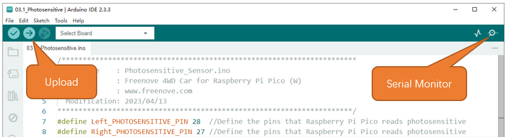

##############################################################################
Chapter 4 Light Tracing Car
##############################################################################

4.1 Photoresistor ADC
*****************************

The photoresistor is very sensitive to the amount of light present. We can use this feature to make a light-tracing car. The car is controlled to trun toward the light source by reading the ADC values of the two photoresistors at the head of the car. Before we start, let us learn how to read the photoresistor value.

Photoresistor 
==============================

A photoresistor is a NPN photosensitive triode.

A Photoresistor is simply a light sensitive resistor. A Photoresistor's output current will change in proportion to the ambient light detected, thus changing the voltage value. With this characteristic, we can use a Photoresistor to detect light intensity. The Photoresistor and its electronic symbol are as follows.

The circuit below is used to detect the change of a photoresistor's resistance value:

In the above circuit, when a photoresistor's resistance vale changes due to a change in light intensity, the voltage between the photoresistor and resistor R1 will also change. Therefore, the intensity of the light can be obtained by measuring this voltage.

Schematic
==============================

Photosensitive sensors are distributed on both sides of the front of the car, and the ADC value collection range of A1 and A2 is 0-1023. It can be seen from the circuit that photoresistors R13 and R14 are two independent light collection channels. When the photoresistor is in an absolutely dark environment, its corresponding ADC value is close to 0; and when it receives absolutely bright light, the value is close to 1023. When the photosensitive sensor receives light of a certain brightness, its corresponding ADC value is between 0-1023. Therefore, if the brightness of the light received by the two photoresistors is different, the values read by the ADC will have a large difference. Utilizing this difference, the car can realize the function of finding light.

Sketch
==============================

Next, we download the code to Raspberry Pi Pico W to test the photoresistors. Open the folder “03.1_Photosensitive” in “Freenove_4WD_Car_Kit_for_Raspberry_Pi_Pico\\Mecanum_wheels\\Sketches” and double click “03.1_Photosensitive.ino”

Code
------------------------------

.. literalinclude:: ../../../freenove_Kit/Mecanum_wheels/Sketches/03.1_Photosensitive/03.1_Photosensitive.ino
    :linenos:
    :language: c
    :dedent:

Code Explanation:
------------------------------

Define the pin to read photoresistors.

.. literalinclude:: ../../../freenove_Kit/Mecanum_wheels/Sketches/03.1_Photosensitive/03.1_Photosensitive.ino
    :linenos:
    :language: c
    :lines: 7-8
    :dedent:

Call analogRead to read the differential value of the photoresistors and store it in the photosensitiveADC.

.. literalinclude:: ../../../freenove_Kit/Mecanum_wheels/Sketches/03.1_Photosensitive/03.1_Photosensitive.ino
    :linenos:
    :language: c
    :lines: 21-22
    :dedent:

Print the photoresistor value through the serial port.

.. literalinclude:: ../../../freenove_Kit/Mecanum_wheels/Sketches/03.1_Photosensitive/03.1_Photosensitive.ino
    :linenos:
    :language: c
    :lines: 23-26
    :dedent:

Click “Upload” to upload the code to Raspberry Pi Pico W. When finishes uploading, click Serial Monitor.

Set baud rate as 115200.

4.2 Light Tracing Car
********************************

It can be seen from the circuit board that R13 and R14 are photosensitive sensors on the right and left respectively. Set the ADC value read by photosensitive R13 to ADC1, and the ADC value read by photosensitive R14 to ADC2. When the light shines on R13, the resistance value of R13 gets smaller, and the ADC1 value increases, and the same is true for R14. Therefore, when ADC1 and ADC2 are greater than the set value at the same time, it means that there is a light source, and the car moves forward, otherwise, the car stops moving. When the car moves forward, detect the values of ADC1 on the right and ADC2 on the left. When ADC1 is greater than ADC2, it indicates that the light source is on the right side of the car, so the car turns right. When ADC1 is to be smaller than ADC2, the car turns left. When the difference between the light intensity on the left and the the right changes, the speed of the car changes accordingly.

Sketch
===============================

When car is powered ON, the ADC value of the current environment will be obtained. After initialization, the buzzer will sound once to remind users to test the light-tracing function. When users approach the car with light source, the car will turn following the light source.

Open the folder “03.2_Photosensitive_Car” in 

“Freenove_4WD_Car_Kit_for_Raspberry_Pi_Pico\\Mecanum_wheels\\Sketches” and double click 

“03.2_Photosensitive_Car.ino”

Code
-------------------------------

.. literalinclude:: ../../../freenove_Kit/Mecanum_wheels/Sketches/03.2_Photosensitive_Car/03.2_Photosensitive_Car.ino
    :linenos:
    :language: c
    :dedent:

The code of light tracing car is as follows:

.. literalinclude:: ../../../freenove_Kit/Mecanum_wheels/Sketches/03.2_Photosensitive_Car/Freenove_4WD_Car_For_Pico_W.cpp
    :linenos:
    :language: c
    :lines: 272-289
    :dedent:

Code Explanation
-------------------------------

Set the sensitivity of the photoresistor. You can adjust the value according to the change of the environment. The value is recommended to be between 50-150.

.. literalinclude:: ../../../freenove_Kit/Mecanum_wheels/Sketches/03.2_Photosensitive_Car/Freenove_4WD_Car_For_Pico_W.cpp
    :linenos:
    :language: c
    :lines: 268-268
    :dedent:

Initialize buzzer, photoresistor and motor.

.. literalinclude:: ../../../freenove_Kit/Mecanum_wheels/Sketches/03.2_Photosensitive_Car/03.2_Photosensitive_Car.ino
    :linenos:
    :language: c
    :lines: 12-14
    :dedent:

Get the ADC value of ambient light during initialization.

.. literalinclude:: ../../../freenove_Kit/Mecanum_wheels/Sketches/03.2_Photosensitive_Car/Freenove_4WD_Car_For_Pico_W.cpp
    :linenos:
    :language: c
    :lines: 278-279
    :dedent:

Adjust the steering of the car according to the location of the light source.

.. literalinclude:: ../../../freenove_Kit/Mecanum_wheels/Sketches/03.2_Photosensitive_Car/Freenove_4WD_Car_For_Pico_W.cpp
    :linenos:
    :language: c
    :lines: 281-288
    :dedent: