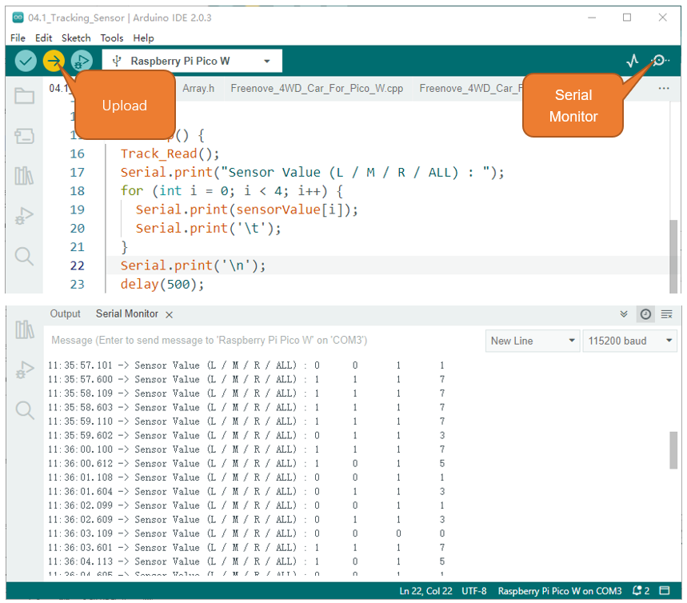
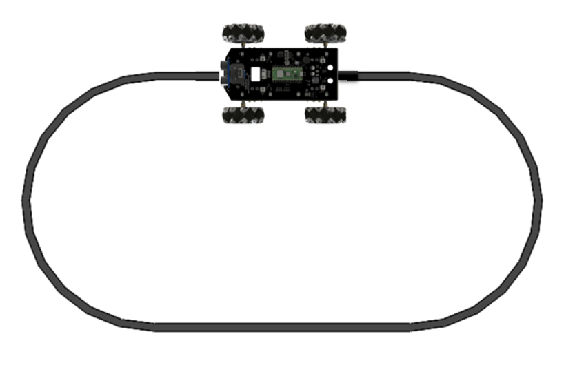

##############################################################################
Chapter 5 Line Tracking Car
##############################################################################

5.1 Line tracking sensor 
***************************************

Track Sensor
=======================================
There are three Reflective Optical Sensors on this car. When the infrared light emitted by infrared diode shines on the surface of different objects, the sensor will receive light with different intensities after reflection.

As we know, black objects absorb light better. So when black lines are drawn on the white plane, the sensor can detect the difference. The sensor can also be called Line Tracking Sensor. 

When conducting experiments in this chapter, please replace the locomotive with LED Matrix as per the instructions.

:red:`Warning:`

:red:`Reflective Optical Sensor (including Line Tracking Sensor) should be avoided using in environment with infrared interference, like sunlight. Sunlight contains a lot of invisible light such as infrared and ultraviolet. Under environment with intense sunlight, Reflective Optical Sensor cannot work normally.`

:red:`The following table shows the values of all cases when three Tracking Sensors detect objects of different colors.`

:red:`Among them, black objects or no objects were detected to represent 1, and white objects were detected to represent 0.`

.. table:: 
    :class: freenove-ow

    +------+--------+-------+---------------+----------------+
    | Left | Middle | Right | Value(binary) | Value(decimal) |
    +======+========+=======+===============+================+
    | 0    | 0      | 0     | 000           | 0              |
    +------+--------+-------+---------------+----------------+
    | 0    | 0      | 1     | 001           | 1              |
    +------+--------+-------+---------------+----------------+
    | 0    | 1      | 0     | 010           | 2              |
    +------+--------+-------+---------------+----------------+
    | 0    | 1      | 1     | 011           | 3              |
    +------+--------+-------+---------------+----------------+
    | 1    | 0      | 0     | 100           | 4              |
    +------+--------+-------+---------------+----------------+
    | 1    | 0      | 1     | 101           | 5              |
    +------+--------+-------+---------------+----------------+
    | 1    | 1      | 0     | 110           | 6              |
    +------+--------+-------+---------------+----------------+
    | 1    | 1      | 1     | 111           | 7              |
    +------+--------+-------+---------------+----------------+

Sketch
==============================

The line tracking module is connected to the Raspberry Pi Pico (W). The Raspberry PI Pico (W) tracks whether the three channels of the module are triggered by acquiring the existence of the line, and prints it out through the serial port.

Open the folder “04.1_Tracking_Sensor” in “Freenove_4WD_Car_Kit_for_Raspberry_Pi_Pico\\Mecanum_wheels\\Sketches” and double click “04.1_Tracking_Sensor.ino”.

Code
--------------------------------------

.. literalinclude:: ../../../freenove_Kit/Mecanum_wheels/Sketches/04.1_Tracking_Sensor/04.1_Tracking_Sensor.ino
    :linenos:
    :language: c
    :dedent:

Code Explanation
-------------------------------------

Trace module initialization

.. literalinclude:: ../../../freenove_Kit/Mecanum_wheels/Sketches/04.1_Tracking_Sensor/04.1_Tracking_Sensor.ino
    :linenos:
    :language: c
    :lines: 12-12
    :dedent:

The function that obtains the tracking module feedback value. After calling this function, Raspberry Pi Pico W will store the data in the array sensorValue[].

.. literalinclude:: ../../../freenove_Kit/Mecanum_wheels/Sketches/04.1_Tracking_Sensor/04.1_Tracking_Sensor.ino
    :linenos:
    :language: c
    :lines: 16-16
    :dedent:

Print the obtained feedback value through serial port.

.. literalinclude:: ../../../freenove_Kit/Mecanum_wheels/Sketches/04.1_Tracking_Sensor/04.1_Tracking_Sensor.ino
    :linenos:
    :language: c
    :lines: 17-22
    :dedent:

Click “Upload” to upload to code to Raspberry Pi Pico (W) development board. After uploading successfully, click “Serial Monitor”.

5.2 Line Tracking Car
*************************************

The car will make different actions according to the value transmitted by the line-tracking sensor.

.. table:: 
    :class: freenove-ow

    +------+--------+-------+---------------+----------------+--------------+
    | Left | Middle | Right | Value(binary) | Value(decimal) | Action       |
    +======+========+=======+===============+================+==============+
    | 0    | 0      | 0     | 000           | 0              | Move Forward |
    +------+--------+-------+---------------+----------------+--------------+
    | 0    | 0      | 1     | 001           | 1              | Turn Right   |
    +------+--------+-------+---------------+----------------+--------------+
    | 0    | 1      | 0     | 010           | 2              | Move Forward |
    +------+--------+-------+---------------+----------------+--------------+
    | 0    | 1      | 1     | 011           | 3              | Turn Right   |
    +------+--------+-------+---------------+----------------+--------------+
    | 1    | 0      | 0     | 100           | 4              | Turn Left    |
    +------+--------+-------+---------------+----------------+--------------+
    | 1    | 0      | 1     | 101           | 5              | Move Forward |
    +------+--------+-------+---------------+----------------+--------------+
    | 1    | 1      | 0     | 110           | 6              | Turn Left    |
    +------+--------+-------+---------------+----------------+--------------+
    | 1    | 1      | 1     | 111           | 7              | Stop         |
    +------+--------+-------+---------------+----------------+--------------+

Turn on the power. Use a black tape to build a line and then put your car on it as below. 

Sketch
===============================

Open the folder “04.2_Track_Car” in “Freenove_4WD_Car_Kit_for_Raspberry_Pi_Pico_W\\Sketches” and double click “04.2_Track_Car.ino”.

Code
--------------------------------

.. literalinclude:: ../../../freenove_Kit/Mecanum_wheels/Sketches/04.2_Track_Car/04.2_Track_Car.ino
    :linenos:
    :language: c
    :dedent:

Code Explanation
--------------------------------

Initialize PCF8574 chip, Motor, Emotion module.

.. literalinclude:: ../../../freenove_Kit/Mecanum_wheels/Sketches/04.2_Track_Car/04.2_Track_Car.ino
    :linenos:
    :language: c
    :lines: 18-20
    :dedent:

The function that obtains the feedback value from the tracking module. After calling this function, Raspberry Pi Pico W will store the data in the array sensorValue[].

.. literalinclude:: ../../../freenove_Kit/Mecanum_wheels/Sketches/04.2_Track_Car/04.2_Track_Car.ino
    :linenos:
    :language: c
    :lines: 25-25
    :dedent:

Control the car to move forward, turn left, turn right, stop, etc. based on the value of line tracking module.

.. literalinclude:: ../../../freenove_Kit/Mecanum_wheels/Sketches/04.2_Track_Car/04.2_Track_Car.ino
    :linenos:
    :language: c
    :lines: 26-52
    :dedent:

.. note::
    
    The tracks made of black tape vary among individuals. If your car cannot move along the black tape, you can modify the parameters in Motor_M_Move().