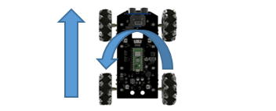

##############################################################################
Chapter 6 Infrared Car
##############################################################################

6.1 Introduction of infrared reception function
**********************************************************

Infrared Remote
==========================================================

An infrared(IR) remote control is a device with a certain number of buttons. Pressing down different buttons will make the infrared emission tube, which is located in the front of the remote control, send infrared ray with

different command. Infrared remote control technology is widely used in electronic products such as TV, air conditioning, etc. Thus making it possible for you to switch TV programs and adjust the temperature of the air conditioning when away from them. The remote control we use is shown below:

Infrared receiver
=========================================================

An infrared(IR) receiver is a component which can receive the infrared light, so we can use it to detect the signal emitted by the infrared remote control. DATA pin here outputs the received infrared signal.

When you use the infrared remote control, the infrared remote control sends a key value to the receiving circuit according to the pressed keys. We can program the Raspberry Pi Pico W to do things like lighting, when a key value is received. 

The following is the key value that the receiving circuit will receive when each key of the infrared remote control is pressed.

.. table:: 
    :align: center
    :class: table-line

    +----------------+-----------+----------------+-----------+
    | ICON           | KEY Value | ICON           | KEY Value |
    +================+===========+================+===========+
    | |Chapter06_01| | BA45FF00  | |Chapter06_11| | F20DFF00  |
    +----------------+-----------+----------------+-----------+
    | |Chapter06_02| | B847FF00  | |Chapter06_12| | F30CFF00  |
    +----------------+-----------+----------------+-----------+
    | |Chapter06_03| | BB44FF00  | |Chapter06_13| | E718FF00  |
    +----------------+-----------+----------------+-----------+
    | |Chapter06_04| | BF40FF00  | |Chapter06_14| | A15EFF00  |
    +----------------+-----------+----------------+-----------+
    | |Chapter06_05| | BC43FF00  | |Chapter06_15| | F708FF00  |
    +----------------+-----------+----------------+-----------+
    | |Chapter06_06| | F807FF00  | |Chapter06_16| | E31CFF00  |
    +----------------+-----------+----------------+-----------+
    | |Chapter06_07| | EA15FF00  | |Chapter06_17| | A55AFF00  |
    +----------------+-----------+----------------+-----------+
    | |Chapter06_08| | F609FF00  | |Chapter06_18| | BD42FF00  |
    +----------------+-----------+----------------+-----------+
    | |Chapter06_09| | E916FF00  | |Chapter06_19| | AD52FF00  |
    +----------------+-----------+----------------+-----------+
    | |Chapter06_10| | E619FF00  | |Chapter06_20| | B54AFF00  |
    +----------------+-----------+----------------+-----------+

.. |Chapter06_09| image:: ../_static/imgs/Standard/6_Infrared_Car/Chapter06_09.png

.. |Chapter06_11| image:: ../_static/imgs/Standard/6_Infrared_Car/Chapter06_11.png

.. |Chapter06_18| image:: ../_static/imgs/Standard/6_Infrared_Car/Chapter06_18.png

This sketch uses the infrared receiving tube to receive the value sent form the infrared remote control, and print it out via the serial port.

Sketch
================================

Each time when you press the infrared remote control, the car will print the received infrared coding value through serial port. 

Open the folder “05.1_IR_Receiver”in 

**“Freenove_4WD_Car_Kit_for_Raspberry_Pi_Pico\\Mecanum_wheels\\Sketches”** and double click 

“05.1_IR_Receiver.ino”.

Code
--------------------------------

.. literalinclude:: ../../../freenove_Kit/Mecanum_wheels/Sketches/05.1_IR_Receiver/05.1_IR_Receiver.ino
    :linenos:
    :language: c
    :dedent:

Download the code to Raspberry Pi Pico (W), open the serial port monitor, set the baud rate to 115200, press the IR remote control, the pressed keys value will be printed out through the serial port. As shown in the following figure: (Note that if the remote control button is long pressed, the infrared receiving circuit receives a "0".)

.. image:: ../_static/imgs/Standard/6_Infrared_Car/Chapter06_21.png
    :align: center

First, include header file. Each time you use the infrared sensor, you need to include the header file at the beginning of the program.

.. literalinclude:: ../../../freenove_Kit/Mecanum_wheels/Sketches/05.1_IR_Receiver/05.1_IR_Receiver.ino
    :linenos: 
    :language: c
    :lines: 7-7
    :dedent:

Second, define an infrared receive pin and the infrared sensor is initialized.

.. code-block:: c
    :linenos:

    #define IR_Pin 3                                 // Infrared receiving pin
    ...
    IrReceiver.begin(IR_Pin, DISABLE_LED_FEEDBACK);  // Start the receiver

Finally, IrReceiver.decode() is used to determine whether an infrared signal has been received, returning true/1 if an infrared signal has been received, or false/0 if no infrared signal has been received;  If an infrared signal is received, the received infrared coded value is printed through the serial port. 

Please note that IrReceiver.resume() must be applied to release the infrared receiver function each time  data are received. Otherwise, the infrared receiver function can only be used once and data cannot be received next time.

.. literalinclude:: ../../../freenove_Kit/Mecanum_wheels/Sketches/05.1_IR_Receiver/05.1_IR_Receiver.ino
    :linenos:
    :language: c
    :lines: 19-23
    :dedent:

6.2 Infrared Car
******************************

Based on the previous section, we use the infrared remote control to control the car. Press the black button on the infrared remote control to control the car to move forward, backward, turn left, and turn right. Press the “Translation ON/OFF” key at the center, the car can move in different directions; press other buttons and the car stops moving.

Sketch
==============================

Open the folder **“05.2_IR_Receiver_Car”** in the **“Freenove_4WD_Car_Kit_for_Raspberry_Pi_Pico\\Mecanum_wheels\\Sketches”** and double click **“05.2_IR_Receiver_Car.ino”**.

Code
------------------------------

.. literalinclude:: ../../../freenove_Kit/Mecanum_wheels/Sketches/05.2_IR_Receiver_Car/05.2_IR_Receiver_Car.ino
    :linenos:
    :language: c
    :dedent:

Compile and upload the code to Raspberry Pi Pico (W). When the '▶' key is pressed, the function of the key given in the fifth row is switched to translate the car in different directions, and when the button is pressed again, the car is switched back to the normal mode.

.. table:: 
    :align: center
    :class: table-line

    +-----------------+-----------------+-------------------------+
    | |Chapter06M_00| | |Chapter06M_12| | Move forward            |
    +-----------------+-----------------+-------------------------+
    | |Chapter06M_01| | |Chapter06M_13| | Turn left               |
    +-----------------+-----------------+-------------------------+
    | |Chapter06M_02| | |Chapter06M_14| | Turn right              |
    +-----------------+-----------------+-------------------------+
    | |Chapter06M_03| | |Chapter06M_15| | Move back               |
    +-----------------+-----------------+-------------------------+
    | |Chapter06M_04| | |Chapter06M_16| | Translation ON/OFF      |
    +-----------------+-----------------+-------------------------+
    | |Chapter06M_05| | |Chapter06M_17| | Move left               |
    +-----------------+-----------------+-------------------------+
    | |Chapter06M_06| | |Chapter06M_18| | Move right              |
    +-----------------+-----------------+-------------------------+
    | |Chapter06M_07| | |Chapter06M_19| | Lef-forward diagonal    |
    +-----------------+-----------------+-------------------------+
    | |Chapter06M_08| | |Chapter06M_20| | Right-backward diagonal |
    +-----------------+-----------------+-------------------------+
    | |Chapter06M_09| | |Chapter06M_21| | Right-forward diagonal  |
    +-----------------+-----------------+-------------------------+
    | |Chapter06M_10| | |Chapter06M_22| | Left-backward diagonal  |
    +-----------------+-----------------+-------------------------+
    | |Chapter06M_11| | |Chapter06M_23| | Enable rotation         |
    +-----------------+-----------------+-------------------------+

Code Explanation:
----------------------------------

The variable **IrReceiver.DecodedIRData.DecodedRawData** stores the infrared remote control encoding information. By calling the **handleControl** function, you can perform different actions corresponding to different code values.  After each execution of the program, the **IrReceiver.resume()** function is called to release the infrared pin.  If you do not call this function, you cannot use the infrared receiving and decoding functions again.

Next, understand how the mecanum wheel car accomplishes both forward movement and rotation. In the program, VY represents the speed mapped to the Y-axis during rotational motion, while VX represents the speed mapped to the X-axis. The angular velocity of the car's rotation is denoted by W, with counterclockwise direction considered positive.

Lines thirty-five to thirty-eight involve calculating the distribution of speeds to each wheel based on the motion equation of the mecanum wheel chassis. We set a fixed counterclockwise rotation of 40 degrees per second and use the delay function to rotate the car by 5°. To ensure the direction of forward movement aligns with the rotation, we adjust the corresponding set_angle by subtracting 5°.

Additionally, the delay function includes a simple voltage linear compensation. When the voltage is not equal to 8 volts, the rotation time changes to achieve a 5° rotation. You have the option to modify the proportion value "time_proportion" to achieve the best forward rotation effect, tailoring it to your specific requirements.

.. literalinclude:: ../../../freenove_Kit/Mecanum_wheels/Sketches/05.2_IR_Receiver_Car/05.2_IR_Receiver_Car.ino
    :linenos:
    :language: c
    :lines: 29-64
    :dedent:

Infrared key code value processing function, receives instructions sent by the infrared remote control, and execute the corresponding program.

.. code-block:: c
    :linenos:

    void handleControl(unsigned long value) {
        // Handle the commands
        switch (value) { 
            case 0xBF40FF00:  // Receive the number '+'
            ...
            case 0xE619FF00:  // Receive the number '-'
            ...
            case 0xF807FF00:  // Receive the number '|<<'
            ...
            case 0xF609FF00:  // Receive the number '>>|'
            ...
            case 0xBB44F00:  // Receive the number 'TEST'
            ...
            case 0xF20DFF00:  // Receive the number 'C'
            ...
            case 0XBC43FF00:  // Receive the number '↗'
            ...
            case 0xE916FF00:  // Receive the number '0'
            ...
            case 0XEA15FF00:  // Receive the number ' ▶'
            ...
            case 0xB847FF00:  // Receive the number 'MENU'
                battery_voltage = Get_Battery_Voltage();
                rotate_flag = !rotate_flag;
                set_angle = 0;
                break;
                ...
            default:          // Control the car to stop moving
                ...
        }
    }

6.3 Multi-Functional Infrared Car
*****************************************

Following the previous section, we now integrate other functions into the infrared car, and most of the car's functions can be controlled by the infrared remote.

Sketch
===================================

Open the folder “05.3_Multi_Functional_Car” in the “Freenove_4WD_Car_Kit_for_Raspberry_Pi_Pico\\Mecanum_wheels\\Sketches” and double click “05.3_Multi_Functional_Car.ino”.

Code
-----------------------------------

.. literalinclude:: ../../../freenove_Kit/Mecanum_wheels/Sketches/05.3_Multi_Functional_Car/05.3_Multi_Functional_Car.ino
    :linenos:
    :language: c
    :dedent:

After the code is successfully uploaded, turn on the power of the car and use the infrared remote to control the car and other functions. The corresponding keys and their functions are shown in the following table:

.. table:: 
    :align: center
    :class: table-line

    +----------------+-----------+---------------------------+----------------+-----------+----------------------------------------+
    | ICON           | KEY Value | Function                  | ICON           | KEY Value | Function                               |
    +----------------+-----------+---------------------------+----------------+-----------+----------------------------------------+
    | |Chapter06_04| | BF40FF00  | Move forward              | |Chapter06_13| | E718FF00  | Change the expression display mode     |
    +----------------+-----------+---------------------------+----------------+-----------+----------------------------------------+
    | |Chapter06_06| | F807FF00  | Turn left                 | |Chapter06_16| | E31CFF00  | Turn off emoticons                     |
    +----------------+-----------+---------------------------+----------------+-----------+----------------------------------------+
    | |Chapter06_08| | F609FF00  | Turn light                | |Chapter06_18| | BD42FF00  | Change the display mode of the WS2812  |
    +----------------+-----------+---------------------------+----------------+-----------+----------------------------------------+
    | |Chapter06_10| | E619FF00  | Move back                 | |Chapter06_19| | AD52FF00  | Turn off WS2812 display                |
    +----------------+-----------+---------------------------+----------------+-----------+----------------------------------------+
    | |Chapter06_07| | EA15FF00  | Stop the car              | |Chapter06_11| | F20DFF00  | Light tracing car mode                 |
    +----------------+-----------+---------------------------+----------------+-----------+----------------------------------------+
    | |Chapter06_09| | E916FF00  | Control servo turn left   | |Chapter06_14| | A15EFF00  | Line tracking car mode                 |
    +----------------+-----------+---------------------------+----------------+-----------+----------------------------------------+
    | |Chapter06_12| | F30CFF00  | Control servo turn right  | |Chapter06_17| | A55AFF00  | Ultrasonic obstacle avoidance car mode |
    +----------------+-----------+---------------------------+----------------+-----------+----------------------------------------+
    | |Chapter06_15| | F708FF00  | Control servo turn to 90° | |Chapter06_20| | B54AFF00  | Manual control mode                    |
    +----------------+-----------+---------------------------+----------------+-----------+----------------------------------------+
    | |Chapter06_03| | BB44FF00  | Control the buzzer        |                |           |                                        |
    +----------------+-----------+---------------------------+----------------+-----------+----------------------------------------+

Since the ultrasonic module shares the interface with the LED Matrix, only one of them can be used at the same time. When the function of the sent button conflicts with the current head module, the buzzer will sound twice continuously. The situations can be as follows:

When "6" is pressed, if the LED Matrix is connected to the head, the buzzer will sound twice.

When "2" is pressed, if the head is connected to an ultrasonic module, the buzzer will sound twice.

When you hear the buzzer beep twice, please replace the module on the head to continue the experiment.

Code Explanation:
--------------------------------

Add the header file for the car.

.. literalinclude:: ../../../freenove_Kit/Mecanum_wheels/Sketches/05.3_Multi_Functional_Car/05.3_Multi_Functional_Car.ino
    :linenos:
    :language: c
    :lines: 7-13
    :dedent:

Initialize each function of the car.

.. literalinclude:: ../../../freenove_Kit/Mecanum_wheels/Sketches/05.3_Multi_Functional_Car/05.3_Multi_Functional_Car.ino
    :linenos:
    :language: c
    :lines: 27-35
    :dedent:

Infrared key code value processing function receives instructions sent by the infrared remote control and execute the corresponding program.

.. code-block:: c
    :linenos:

    void handleControl(unsigned long value) {
        // Handle the commands
        switch (value) {
            case 0xBF40FF00:  // Receive the number '+'
            ...
            case 0xE619FF00:  // Receive the number '-'
            ...
            case 0xF807FF00:  // Receive the number '|<<'
            ...
            case 0xF609FF00:  // Receive the number '>>|'
            ...
            case 0xEA15FF00:  // Receive the number '▶'
            ...
            case 0xE916FF00:  // Receive the number '0'
            ...
            case 0xF30CFF00:  // Receive the number '1'
            ...
            case 0xF708FF00:  // Receive the number '4'
            ...
            case 0xF20DFF00:  // Receive the number 'C'
            ...
            case 0xA15EFF00:  // Receive the number '3'
            ...
            case 0xA55AFF00:  // Receive the number '6'
            ...
            case 0xB54AFF00:  // Receive the number '9'
            ...
            case 0xBB44FF00:  // Receive the number 'TEST'
            ...
            case 0xE718FF00:  // Receive the number '2'
            ...
            case 0xE31CFF00:  // Receive the number '5'
            ...
            case 0xBD42FF00:  // Receive the number '7'
            ...
            case 0xAD52FF00:  // Receive the number '8'
            ...
            case 0xFFFFFFFF:  // Remain unchanged
                break;
            default:
                break;
        }
    }

