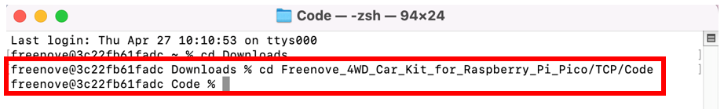
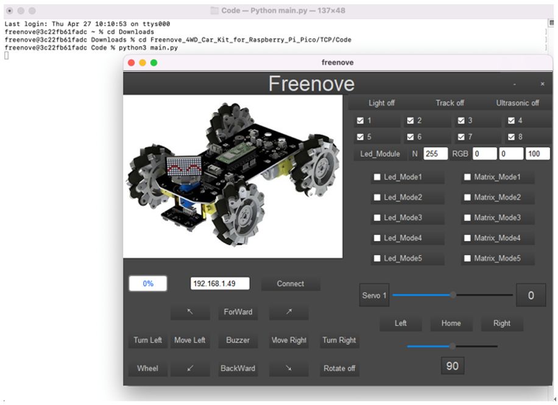

##############################################################################
Chapter 7 WiFi Car(Only for Pico W)
##############################################################################

7.1 WiFi Sending and Receiving Data
*******************************************

This chapter requires the use of a Raspberry Pico W. If you use a Pico, you will not be able to finish projects in this chapter.

Before programming, we need to have a basic understanding of WiFi.

Station mode
============================================

When Raspberry Pi Pico W is in Station mode, it acts as a WiFi client. It can connect to the router network and communicate with other devices on the same LAN. As shown below, the PC is connected to a wireless router, and if Raspberry Pi Pico W wants to communicate with the PC, it needs to be connected to the same router. 

AP mode
============================================

When Raspberry Pi Pico W selects AP mode, it creates a hotspot network that is separate from the Internet and waits for other WiFi devices to connect. As shown in the figure below, Raspberry Pi Pico W is used as a hotspot. If a mobile phone or PC wants to communicate with Raspberry Pi Pico W, it must be connected to the hotspot of Raspberry Pi Pico W. Only after a connection is established with Raspberry Pi Pico W can they communicate.

AP+Station mode
-------------------------------------------

In addition to AP mode and station mode, Raspberry Pi Pico W can also use AP mode and station mode at the same time. This mode includes the functions of the previous two modes. Turn on Raspberry Pi Pico W's station mode, connect it to the router network, and it can communicate with the Internet via the router. At the same time, turn on its AP mode to create a hotspot network and other WiFi devices can choose to connect to the router network or the hotspot network to communicate with Raspberry Pi Pico W.

TCP connection
-------------------------------------------

Before transmitting data, TCP needs to establish a logical connection between the sending end and the receiving end. It provides reliable and error-free data transmission between the two computers. In the TCP connection, the client and the server must be clarified. The client sends a connection request to the server, and each time such a request is proposed, a "three-times handshake" is required.

Three-times handshake: In the TCP protocol, during the preparation phase of sending data, the client and the server interact three times to ensure the reliability of the connection, which is called "three-times handshake".

The first handshake, the client sends a connection request to the server and waits for the server to confirm.

The second handshake, the server sends a response back to the client informing that it has received the connection request.

The third handshake, the client sends a confirmation message to the server again to confirm the connection. 

TCP is a connection-oriented, low-level transmission control protocol. After TCP establishes a connection, the client and server can send and receive messages to each other, and the connection will always exist as long as the client or server does not initiate disconnection. Each time one party sends a message, the other party will reply with an ack signal.

.. image:: ../_static/imgs/Standard/7_WiFi_Car(Only_for_Pico_W)/Chapter07_03.png
    :align: center

Install Freenove app
===========================================

There are three ways to install our app. 

Method 1
-------------------------------------------

Use Google play to search “Freenove”, download and install.

Method 2
-------------------------------------------

Visit https://play.google.com/store/apps/details?id=com.freenove.suhayl.Freenove, and click install.

Method 3
-------------------------------------------

Visit https://github.com/Freenove/Freenove_app_for_Android, download the files in this library, and install freenove.apk to your Android phone manually. 

Menu
------------------------------------------

Open application “Freenove”, as shown below:

Introduction to the APP
============================================

In this chapter, we use Freenove 4WD Car for Raspberry Pi Pico W, so it is necessary to understand the interface of this mode. 

Sketch
============================================

Open “06.1_WiFi_APP_TcpServer” in 

**“Freenove_4WD_Car_Kit_for_Raspberry_Pi_Pico\\Mecanum_wheels\\Sketches”** and double click 

“06.1_WiFi_APP_TcpServer.ino”.

Before uploading the code, you need to modify it according to the name and password of your router.

Code
--------------------------------------------

.. literalinclude:: ../../../freenove_Kit/Mecanum_wheels/Sketches/06.1_WiFi_APP_TcpServer/06.1_WiFi_APP_TcpServer.ino
    :linenos:
    :language: c
    :dedent:

Uplode the code to Raspberry Pi Pico W car and open serial monitor.

Open mobliephone app and select Freenove 4WD Car for Raspberry Pi Pico (W).

Make sure your mobile phone and Raspberry Pi Pico W car are connected to the same router. According to the aforementioned IP address, enter the corresponding IP address, and then click Connect. Tap the button on the screen and you can see the data on the serial monitor.

Code Explanation:
-----------------------------------------

Add the library functions of WiFi. Each time before using WiFi, please add these library functions.

.. literalinclude:: ../../../freenove_Kit/Mecanum_wheels/Sketches/06.1_WiFi_APP_TcpServer/06.1_WiFi_APP_TcpServer.ino
    :linenos:
    :language: c
    :lines: 8-8
    :dedent:

Define two pointer variables to store information.

.. literalinclude:: ../../../freenove_Kit/Mecanum_wheels/Sketches/06.1_WiFi_APP_TcpServer/06.1_WiFi_APP_TcpServer.ino
    :linenos:
    :language: c
    :lines: 11-12
    :dedent:

Connect Raspberry Pi Pico W to the router. After the router is successfully connected, Raspberry Pi Pico W will print the IP address information to the serial monitor.

.. literalinclude:: ../../../freenove_Kit/Mecanum_wheels/Sketches/06.1_WiFi_APP_TcpServer/06.1_WiFi_APP_TcpServer.ino
    :linenos:
    :language: c
    :lines: 29-30
    :dedent:

Mobile applications use a server for transmitting commands.  Set Raspberry Pi Pico W to start a server.  The server with port 4002 is used to send commands.

.. literalinclude:: ../../../freenove_Kit/Mecanum_wheels/Sketches/06.1_WiFi_APP_TcpServer/06.1_WiFi_APP_TcpServer.ino
    :linenos:
    :language: c
    :lines: 31-32
    :dedent:

Define a WiFi client object to monitor whether the server has a client requesting access signal.

.. literalinclude:: ../../../freenove_Kit/Mecanum_wheels/Sketches/06.1_WiFi_APP_TcpServer/06.1_WiFi_APP_TcpServer.ino
    :linenos:
    :language: c
    :lines: 36-36
    :dedent:

Determine whether there is a client connected to the server.

.. literalinclude:: ../../../freenove_Kit/Mecanum_wheels/Sketches/06.1_WiFi_APP_TcpServer/06.1_WiFi_APP_TcpServer.ino
    :linenos:
    :language: c
    :lines: 39-39
    :dedent:

Call available function to query whether the client has sent data to the server.

.. literalinclude:: ../../../freenove_Kit/Mecanum_wheels/Sketches/06.1_WiFi_APP_TcpServer/06.1_WiFi_APP_TcpServer.ino
    :linenos:
    :language: c
    :lines: 40-40
    :dedent:

Call readStringUntil function to read a line of data from the client and print it to the serial monitor.

.. literalinclude:: ../../../freenove_Kit/Mecanum_wheels/Sketches/06.1_WiFi_APP_TcpServer/06.1_WiFi_APP_TcpServer.ino
    :linenos:
    :language: c
    :lines: 41-42
    :dedent:

Call stop() function to close the client connection.

.. literalinclude:: ../../../freenove_Kit/Mecanum_wheels/Sketches/06.1_WiFi_APP_TcpServer/06.1_WiFi_APP_TcpServer.ino
    :linenos:
    :language: c
    :lines: 49-49
    :dedent:

Reference
----------------------------------

.. py:function:: Class Station	

    Every time when using WiFi, you need to include header file "WiFi.h.".

    **begin(ssid, password,channel, bssid, connect):** Raspberry Pi Pico W is used as Station to connect hotspot.

    **ssid:** WiFi hotspot name

    **password:** WiFi hotspot password

    **channel:** WiFi hotspot channel number; communicating through specified channel; optional parameter 

    **bssid:** mac address of WiFi hotspot, optional parameter

    **connect:** blloean optional parameter, defaulting to true. If set as false, then Pico W won't connect WiFi.

    **config(local_ip, gateway, subnet, dns1, dns2):** set static local IP address.

        **local_ip:** station fixed IP address.

        **subnet:** subnet mask

        **dns1,dns2:** optional parameter, defines IP address of domain name server

    **status:** obtain the connection status of WiFI

    **local IP():** obtian IP address in Station mode 

    **disconnect():** disconnect wifi

    **setAutoConnect(boolen):** set automatic connection Every time Raspberry Pi Pico W is powered on, it will connect WiFi automatically.

    **setAutoReconnect(boolen):** set automatic reconnection Every time Raspberry Pi Pico W disconnects from WiFi, it will reconnect to WiFi automatically.

.. py:function:: Class AP	

    Every time when using WiFi, you need to include header file "WiFi.h.".

    **softAP(ssid, password, channel, ssid_hidden, max_connection):**

    **ssid:** WiFi hotspot name

    **password:** WiFi hotspot password

    **channel:** Number of WiFi connection channels, range 1-13. The default is 1.

    **ssid_hidden:** Whether to hide WiFi name from other devices. The default is not hide.

    **max_connection:** Maximum number of WiFi connected devices. The range is 1-4. The default is 4.

    **softAPConfig(local_ip, gateway, subnet):** set static local IP address. 

        **local_ip:** station fixed IP address.

        **Gateway:** gateway IP address

        **Subnet:** subnet mask

    **softAP():** obtian IP address in AP mode 

    **softAPdisconnect ():** disconnect AP mode.

.. py:function:: Class Client	

    Every time when using Client, you need to include header file "WiFi.h."

    **connect(ip, port, timeout)/connect(*host, port, timeout):** establish a TCP connection.

        **ip, \*host:** ip address of target server 

        **port:** port number of target server

        **timeout:** connection timeout

    **connected():** judge whether client is connecting. If return value is 1, then connect successfully; If return value is 0, then fail to connect.

    **stop():** stop tcp connection

    **print():** send data to server connecting to client

    **available():** return to the number of bytes readable in receive buffer, if no, return to 0 or -1.

    **read():** read one byte of data in receive buffer

    **readString():** read string in receive buffer 

.. py:function:: Class Server	
    
    Every time use Server functionality, we need to include header file"WiFi.h".
    
    **WiFiServer(uint16_t port=80, uint8_t max_clients=4):** create a TCP Server.
    
        **port:** ports of Server; range from 0 to 65535 with the default number as 80.
    
        **max_clients:** maximum number of clients with default number as 4.
    
    **begin(port):** start the TCP Server.
    
        **port:** ports of Server; range from 0 to 65535 with the default number as 0.
    
    **setNoDelay(bool nodelay):** whether to turn off the delay sending functionality.
    
        **nodelay:** true stands for forbidden Nagle algorithm.
    
    **close():** close tcp connection.
    
    **stop():** stop tcp connection.

7.2 WiFi Car by APP
******************************************

Based on the previous sector, we now integrate other functions with WiFi, so that most of the car's functions can be controlled with phone APP.

Sketch
=================================

Open the folder “06.2_Multi_Functional_Car” in Freenove_4WD_Car_Kit_for_Raspberry Pi Pico\\Mecanum_wheels\\Sketches and double click “06.2_Multi_Functional_Car.ino”.

Before compiling the code, please modify the code according to the name and password of your WiFi.

:red:`To enable Raspberry Pi Pico W's own router functionality, set line 37 to WiFi_Setup(1); to connect Raspberry Pi Pico W to the router, set line 37 to WiFi_Setup(0).`

:red:`In the code we provide, the default is: WiFi_Setup(0).`

:red:`At this point, you need to make sure your phone and the Raspberry PI Pico W car are connected to the same router.`

Code
--------------------------------

.. literalinclude:: ../../../freenove_Kit/Mecanum_wheels/Sketches/06.2_Multi_Functional_Car/06.2_Multi_Functional_Car.ino
    :linenos:
    :language: c
    :dedent:

After downloading the code, open the Freenove app on your mobile and select the corresponding model to enter the control interface. Connect to the IP address displayed on the serial monitor to establish a connection and start controlling the car.

When the spin mode is not enabled, the first joystick is used for the omnidirectional movement of the car, while the second joystick is used to adjust the direction of the car. You can simultaneously control both joysticks, for example, by sliding the X-axis of the first joystick to the far right and sliding the X-axis of the second joystick to the far left, which will make the car rotate around the front two wheels.

In the spin mode, the first joystick is still used for the car's omnidirectional movement, while the second joystick is employed to adjust the car's rotation angle. However, it should be noted that, to rotate and move the car forward in a specific direction, you should keep the second joystick's position stable and not release it. Moreover, at this moment, the first joystick is not effective, as it is not used for controlling the car's movement in this scenario.

.. note::
    
    As each car may be influenced by various factors like installation, battery voltage, and motor performance, it is highly recommended to adjust the time proportion before enabling the spin mode. When the car deviates towards the rotation direction, reduce the time_proportion, and when it deviates in the opposite direction of rotation, increase the time_proportion. This adjustment allows you to fine-tune the behavior of the car during rotation, ensuring optimal performance and compensating for any variations among different vehicles. By customizing the time proportion, you can enhance the rotation mode's effectiveness and achieve more precise and reliable rotation movements for each individual car.

.. code-block:: c
    :linenos:

    float time_proportion = 5.7;        //If you want to get the best out of the rotation mode, change the value by experimenting

Code Explanation:
---------------------

Add the driver header files of the car. 

The three header files starting with "WiFi" contain the WiFi driver configuration function of Raspberry Pi Pico W.

Freenove_4WD_Car_WiFi.h Freenove_4WD_Car_WiFi.h contains command information for WiFi signal transmission and camera pin configuration for Raspberry Pi Pico W.

Freenove_4WD_Car_Emotion.h contains the driver configuration function of the LED matrix module. 

Freenove_4WD_Car_WS2812.h contains the driver configuration function of the RGB LEDs. Freenove_4WD_Car_For_Pico_W.h contains the driver configuration function of the car.

.. literalinclude:: ../../../freenove_Kit/Mecanum_wheels/Sketches/06.2_Multi_Functional_Car/06.2_Multi_Functional_Car.ino
    :linenos:
    :language: c
    :lines: 7-16
    :dedent:

Before each code upload, you can change the following ssid_Router and password_Router based on your WiFi name and password. The program uses STA mode by default. You need to make sure your phone is connected to the same router as your Raspberry PI Pico W car.

When you use AP mode, change the code to WiFi_Setup(1), and the Raspberry PI Pico W will create a WiFi named "Sunshine" corresponding to the WiFi configuration. Note: Sunshine is not connected to the Internet.  So if you choose to connect it, your phone will disconnect from the Internet.

.. literalinclude:: ../../../freenove_Kit/Mecanum_wheels/Sketches/06.2_Multi_Functional_Car/06.2_Multi_Functional_Car.ino
    :linenos:
    :language: c
    :lines: 38-41
    :dedent:

Open a TCP server port.  Port 4002 is used to receive commands from the car.

.. literalinclude:: ../../../freenove_Kit/Mecanum_wheels/Sketches/06.2_Multi_Functional_Car/06.2_Multi_Functional_Car.ino
    :linenos:
    :language: c
    :lines: 42-42
    :dedent:

Call the WiFi_Init() to initialize the WiFi parameters. Call the WiFi_Setup() to initialize the Raspberry Pi Pico W’s WiFi. 

AP mode starts when the WiFi_Setup parameter is 1, and STA mode when the parameter is 0. After Raspberry Pi Pico W starts WIFI, it prints the IP information on the serial monitor.

.. literalinclude:: ../../../freenove_Kit/Mecanum_wheels/Sketches/06.2_Multi_Functional_Car/06.2_Multi_Functional_Car.ino
    :linenos:
    :language: c
    :lines: 47-47
    :dedent:

Initialize the car's buzzer, LED matrix module, RGB LEDs, WiFi, motor, servo, photoresistor and line tracking modules.

.. literalinclude:: ../../../freenove_Kit/Mecanum_wheels/Sketches/06.2_Multi_Functional_Car/06.2_Multi_Functional_Car.ino
    :linenos:
    :language: c
    :lines: 44-59
    :dedent:

Monitor TCP server port 4002. If a client connects to this port, Raspberry PI Pico W will print messages of WiFi connection on the serial port. When a client connects to this port, it receives information from the client until the client disconnects. When Raspberry PI Pico W detects that the client is disconnected, it closes the TCP connection and prints a WiFi disconnect prompt message.

.. code-block:: c
    :linenos:

    WiFiClient client = server_Cmd.available();  //listen for incoming clients
    if (client) {                                //if you get a client
        Serial.println("Cmd_Server connected to a client.");
        while (client.connected()) {
            ...
        } 
        client.stop();  //close the connection:
        Serial.println("Command Client Disconnected.");
        sendOnceModuleCheck = 1;
        // rp2040.restart();
    }

Get_Command(), the command parsing function. Every time this function is used, the command received by TCP will be sent to this function through inputStringTemp, and the command and parameters will be parsed and stored in the global variable array CmdArray and paramters.

.. literalinclude:: ../../../freenove_Kit/Mecanum_wheels/Sketches/06.2_Multi_Functional_Car/06.2_Multi_Functional_Car.ino
    :linenos:
    :language: c
    :lines: 260-269
    :dedent:

Judge the client's data and use different functions of the car according to different commands.

.. code-block:: c
    :linenos:

    if (CmdArray[0] == CMD_LED_MOD)  //Set the display mode of car colored lights
      ...
    if (CmdArray[0] == CMD_LED)  //Set the color and brightness of the car lights
      ...
    if (CmdArray[0] == CMD_MATRIX_MOD)  //Set the display mode of the LED matrix
      ...
    if (CmdArray[0] == CMD_BUZZER)  //Buzzer control command
      ...
    if (CmdArray[0] == CMD_POWER)  //Power query command
      ...
    if (CmdArray[0] == CMD_M_MOTOR)  //Network control car movement command
      ...
    if (CmdArray[0] == CMD_CAR_ROTATE)  //Rotate command
      ...
    if (CmdArray[0] == CMD_SERVO) {  //Network control servo motor movement command
      ...
    if (CmdArray[0] == CMD_CAR_MODE) {  //Car command Mode
      ...

The most significant aspect of the aforementioned commands relates to the motion of the car chassis, where we employ the mecanum wheel motion calculation formula as explained earlier. For those who are unfamiliar with this concept, you can refer back to the introduction about mecanum wheels in the preamble to gain a better understanding.

The mobile app transmits four parameters, representing the angles and lengths of the two joysticks. These angles are measured with respect to the Y-axis, where counterclockwise rotation towards the negative Y-axis corresponds to an angle range of 0 to 180 degrees, and clockwise rotation follows the same principle, with an angle range of 0 to -180 degrees. Utilizing trigonometric functions, we can break down these angles into their respective components along the X and Y axes.

.. literalinclude:: ../../../freenove_Kit/Mecanum_wheels/Sketches/06.2_Multi_Functional_Car/06.2_Multi_Functional_Car.ino
    :linenos:
    :language: c
    :lines: 114-126
    :dedent:

When the spin mode is engaged, adjusting the second joystick without changing its direction allows for continuous rotation of the car around its center, while simultaneously moving the car forward or backward in the desired direction. 

.. literalinclude:: ../../../freenove_Kit/Mecanum_wheels/Sketches/06.2_Multi_Functional_Car/06.2_Multi_Functional_Car.ino
    :linenos:
    :language: c
    :lines: 147-160
    :dedent:

The following three functions run in a non-blocking manner. Call the Emotion_Show() function to control the LED matrix, call the WS2812_Show() function to control the RGB LEDs of the car, and call the Car_Select() function to control the mode of the car.

.. code-block:: c
    :linenos:

    Emotion_Show(emotion_task_mode);  //Led matrix display function
    ...
    WS2812_Show(ws2812_task_mode);  //Car color lights display function
    Car_Select(carFlag);            //Pico W Car mode selection function

7.3 WiFi Car by PC
************************************

In addition to using a mobile phone to control the WiFi car, we also provide users with a host computer to control the car. In this chapter, the car still uses the code in section 7.2

Run client on windows system
=================================

There are two ways to run client on Windows.

Option 1 Run the executable file directly.
---------------------------------------------------

Open main.exe in Freenove_4WD_Car_Kit_for_Raspberry_Pi_Pico\\TCP\\Application. 

The interface of client is as follows:

The function of the client is as follows:

According to the prompt message printed on the Raspberry Pi Pico W serial monitor, enter the IP address into "IP Address" and click "Connect", and you can control the Raspberry Pi Pico W car through this client

Option 2 Install python3 and some related python libraries to run client. 
--------------------------------------------------------------------------------

If you want to modify the client, please follow this section.

Install python3
------------------------------------------------

Download and install Python3 package.

https://www.python.org/downloads/windows/

.. image:: ../_static/imgs/Mecanum/7_WiFi_Car(Only_for_Pico_W)/Chapter07_05.png
    :align: center

Select Python3.8.1.

Click Windows x86 executable installer to download. After downloading, click to install. 

**Please note that “Add Python 3.8 to PATH” MUST be check.**

Check all the options and then click “Next”.

Here you can select the installation path of Python. We install it at D drive. If you are a novice, you can select the default path.

Wait for it to finish installing.

Now the installation is finished.

Install PyQt5、opencv、numpy and other libraries.

Press “Ctrl” and “R” on the keyboard at the same time will pop up a window.

Enter cmd in the pop-up window and click “OK”.

Use the command to enter the storage location of Freenove_4WD_Car_Kit_for_Raspberry_Pi_Pico Here we assume it is saved in D drive.

The address depends on where you saved Freenove_4WD_Car_Kit_for_Raspberry_Pi_Pico. You need to modify it based on your own storage location.

1.	Input “D:”, press enter to enter D drive, and then input “cd D:\Freenove_4WD_Car_Kit_for_Raspberry_Pi_Pico\TCP\Code”, press enter to enter the folder.

2.	Input “Python setup_windows.py” and press enter. If it fails, you can input “Python3 setup_windows.py” to try again.

3.	Wait for it to finish installing and press any key according to the prompt. When it displays “All libraries installed successfully”, it indicates the environment is installed successfully. 

If not all libraries are installed successfully, it will prompt "Some libraries have not been installed. Please run Python3 setup_windows.py again', and then you need to enter and execute the command again. Most installation failures are caused by poor networks. You can Check your network before installation. 

Run main.py
---------------------------------

1.	Input “D:”, press enter to enter D drive and then input “cd D:\\Freenove_4WD_Car_Kit_for_Raspberry_Pi_Pico\\TCP\\Code”, press enter to enter the folder.  

2.	Input “Python main.py” and press enter. If it fails, you can input “Python3 main.py” to try again. 

After the program runs, you can control the car through this window.

If you want to modify the code, you can modify the files in TCP folder.

Control the car with keyboard
----------------------------------

The car can be controlled by clicking the client. And it can also be controlled by pressing keys on your keyboard.

The following is the corresponding operation of the buttons and keys.

.. table:: 
    :class: freenove-ow

    +-----------------------+-------------+----------------------------+
    | Button on Client      | Key         | Action                     |
    +=======================+=============+============================+
    | ForWard               | W           | Move                       |
    +-----------------------+-------------+----------------------------+
    | BackWard              | S           | Back off                   |
    +-----------------------+-------------+----------------------------+
    | Turn Left             | A           | Turn left                  |
    +-----------------------+-------------+----------------------------+
    | Turn Right            | D           | Turn right                 |
    +-----------------------+-------------+----------------------------+
    | Move Left             | Shift+A     | Move left                  |
    +-----------------------+-------------+----------------------------+
    | Move Right            | Shift+B     | Move right                 |
    +-----------------------+-------------+----------------------------+
    | ↖                     | Q           | Left-forward diagonal      |
    +-----------------------+-------------+----------------------------+
    | ↗                     | E           | Right-forward diagonal     |
    +-----------------------+-------------+----------------------------+
    | ↙                     | Z           | Left-backward diagonal     |
    +-----------------------+-------------+----------------------------+
    | ↘                     | X           | Right-backward diagonal    |
    +-----------------------+-------------+----------------------------+
    | Rotate                | O           | On/off Rotation            |
    +-----------------------+-------------+----------------------------+
    | Left                  | left arrow  | Turn servo left            |
    +-----------------------+-------------+----------------------------+
    | Right                 | right arrow | Turn servo right           |
    +-----------------------+-------------+----------------------------+
    | Home                  | Home        | Turn servo back Home       |
    +-----------------------+-------------+----------------------------+
    | Connect/ Disconnect   | C           | On/off Connection          |
    +-----------------------+-------------+----------------------------+
    | Buzzer                | Space       | On/off Buzzer              |
    +-----------------------+-------------+----------------------------+
    | Led_Mode 1,2,3,4,5    | L           | Switch RGB Led Mode        |
    +-----------------------+-------------+----------------------------+
    | Matrix_Mode 1,2,3,4,5 | K           | Switch Matrix Mode         |
    +-----------------------+-------------+----------------------------+
    | Matrix_Static Mode    | J           | Switch Matrix Static Mode  |
    +-----------------------+-------------+----------------------------+
    | Light Car Mode        | R           | On/off Light Car Mode      |
    +-----------------------+-------------+----------------------------+
    | Track Car Mode        | T           | On/off Track Car Mode      |
    +-----------------------+-------------+----------------------------+
    | Ultrasonic Car Mode   | Y           | On/Off Ultrasonic Car Mode |
    +-----------------------+-------------+----------------------------+

The function of SliderBar is below:

.. table:: 
    :class: freenove-ow

    +-----------+----------------------------------------------------------+
    | SliderBar | Function                                                 |
    +===========+==========================================================+
    | Servo 1   | SliderBar Servo 1 is used to slightly adjust the angle.  |
    |           |                                                          |
    |           | If the servo is not fully centered during installation,  |
    |           |                                                          |
    |           | you can slightly tune it via the SliderBar.              |
    +-----------+----------------------------------------------------------+

Other control information:

.. table:: 
    :class: freenove-ow

    +---------------------------+------------------------------------------------+
    | Control                   | Function                                       |
    +===========================+================================================+
    | IP address Edit box       | Enter IP address of Raspberry Pi Pico W.       |
    +---------------------------+------------------------------------------------+
    | Power box                 | Show power level.                              |
    +---------------------------+------------------------------------------------+
    | N,R,G,B Edit box          | Control the color of LED selected.             |
    +---------------------------+------------------------------------------------+
    | Button “Light On/Off”     | Turn on the light seeking function of the car. |
    +---------------------------+------------------------------------------------+
    | Button “Track On/Off”     | Turn on the tracking function of the car.      |
    +---------------------------+------------------------------------------------+
    | Button“Ultrasonic On/Off” | Turn on the car's obstacle avoidance function. |
    +---------------------------+------------------------------------------------+

Run client on macOS system
===================================

Here we take MacOS 10.13 as an example. To run client on MacOS, you need to install some software and libraries. MacOS 10.13 comes with python2 but not python3. However, the projects in this program need to be run with python3, so you need to install it first. 

Install python3
-----------------------------------

Download installation package, link: https://www.python.org/downloads/

Click Python 3.8.2.

At the bottom of the page, click macOS 64-bit installer and download installation package.

Click Continue.

.. image:: ../_static/imgs/Mecanum/7_WiFi_Car(Only_for_Pico_W)/Chapter07_22.png
    :align: center

Click Continue

Click Agree.

Click Install. If your computer has a password, enter the password and Install Software.

Now the installation succeeds.

You can find it in Applications.

Install PyQt5、opencv、numpy and other libraries
----------------------------------------------------------

If you have not yet downloaded the code of Raspberry Pi Pico W car to your macOS, you can download it from the following link: https://github.com/Freenove/Freenove_4WD_Car_Kit_for_Raspberry_Pi_Pico.git

After downloading, you can find it in **Downloads** of Macintosh HD. 

Open **Terminal**.

Enter the following commands in Terminal

1.	Enter “Downloads” (where the code locates). If your code locates in a different path, you need to enter the location of your code. 

.. code-block:: console
    
    cd Downloads

2.	Enter the directo ry where setup_mac.py locates 

.. code-block:: console
    
    cd Freenove_4WD_Car_Kit_for_Raspberry_Pi_Pico/TCP/Code

3.	Run setup_macos.py:

.. code-block:: console
    
    python3 setup_macos.py

The installation takes some time. Please wait with patience. When installs successfully, it will print "All libraries installed successfully": 

Note: If not all libraries are installed successfully, it will prompt “Some libraries have not been installed”. Please input and run Python3 setup_macos.py again. Most installation failures are caused by poor networks. You can Check your network before installation

Run main.py
---------------------------------

Following the previous steps, after the installation completes, you are now in the directory where setup_mac.py is located. (Freenove_4WD_Car_Kit_for_Raspberry_Pi_Pico/TCP/Code)

Enter the following command to run main.py.

.. code-block:: console
    
    python3 main.py

The way to control macOS System client is the same as Windows (:ref:`Control <fnk0089/codes/mecanum/7_wifi_car(only_for_pico_w):control the car with keyboard>`).