##############################################################################
Chapter 1 Assembling Smart Car
##############################################################################

If you have any concerns, please feel free to contact us via support@freenove.com

Assembling the Car
******************************

Installing Motor and Wheels
====================================

There are 4 bracket packages to fix motors, each containg an aluminum bracket, two M3*30 screws, two M3*8 screws and two M3 nuts, as shown below:

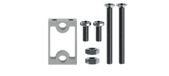

Installation steps:

.. table::
    :align: center

    +---------------------------------------------------------------------------------------------------------------------------------------------------------------------+
    | Step 1 Fix the bracket on the shield.                                                                                                                               |
    |                                                                                                                                                                     |
    | |Chapter01_01|                                                                                                                                                      |
    |                                                                                                                                                                     |
    | Put the bottom of the car up, use two M3*8 screws to fix the bracket on the shield.                                                                                 |
    +---------------------------------------------------------------------------------------------------------------------------------------------------------------------+
    | Step 2 Install the motor to the bracket.                                                                                                                            |
    |                                                                                                                                                                     |
    | |Chapter01_02|                                                                                                                                                      |
    |                                                                                                                                                                     |
    | Use two M3*30 screws and two M3 nuts to fix the motor on the bracket.                                                                                               |
    |                                                                                                                                                                     |
    | :red:Caution: Do not remove the cable tie from the motor; otherwise, the motor cable may become detached.`                                                          |
    |                                                                                                                                                                     |
    | If you perform step 2 before step 1, please check whether the M3 nut located under the motor in step 2 is at the same level as the bracket.                         |
    |                                                                                                                                                                     |
    | If the M3 nut below is not horizontal, it may easily cause damage to the PCB surface during installation step 1, resulting in a short circuit on the control board. |
    |                                                                                                                                                                     |
    | |Chapter01_03|                                                                                                                                                      |
    +---------------------------------------------------------------------------------------------------------------------------------------------------------------------+
    | Step 3 Connect the motor wire to the corresponding socket.                                                                                                          |
    |                                                                                                                                                                     |
    | |Chapter01_04|                                                                                                                                                      |
    |                                                                                                                                                                     |
    | Put the motor wires through the holes on the shield and connect them to the corresponding sockets on the top.                                                       |
    +---------------------------------------------------------------------------------------------------------------------------------------------------------------------+
    | Step 4 Install the wheel to the motor.                                                                                                                              |
    |                                                                                                                                                                     |
    | |Chapter01_05|                                                                                                                                                      |
    |                                                                                                                                                                     |
    | Note: The hole is not round. Please align the hole and fix the wheel to the motor.                                                                                  |
    |                                                                                                                                                                     |
    | |Chapter01_06|                                                                                                                                                      |
    |                                                                                                                                                                     |
    | The installation of the four wheels is similar. Repeat the above installation steps to complete the installation.                                                   |
    +---------------------------------------------------------------------------------------------------------------------------------------------------------------------+

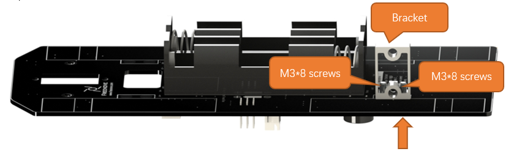
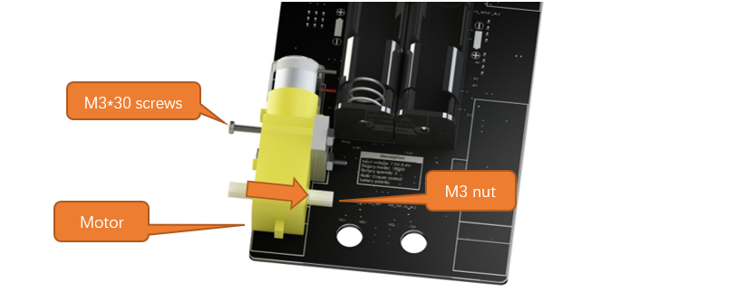

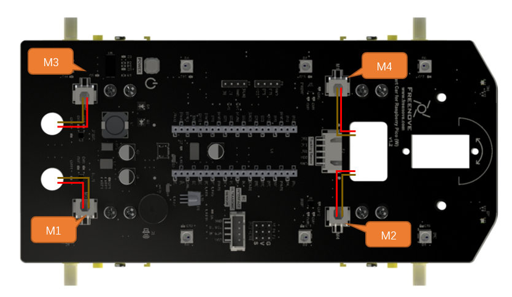
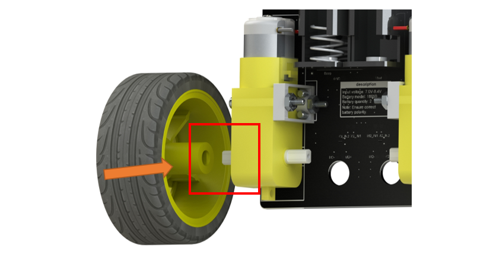
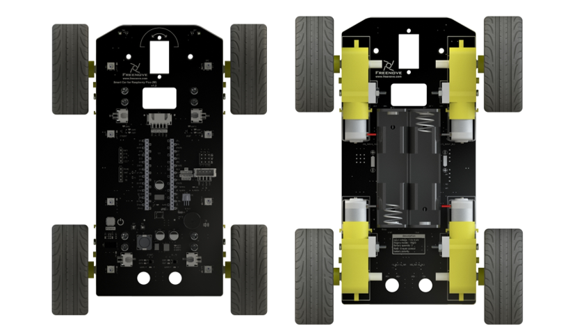

.. table::
    :align: center

    +----------------------------------------------------------------------------------------------------------------------------------------+
    | Plug Raspberry Pi Pico (W) into the shield.                                                                                            |
    |                                                                                                                                        |
    | |Chapter01_07|                                                                                                                         |
    |                                                                                                                                        |
    | Please pay attention to the orientation of Raspberry Pi Pico (W). Do NOT reverse it; Otherwise, it may burn the Raspberry Pi Pico (W). |
    +----------------------------------------------------------------------------------------------------------------------------------------+

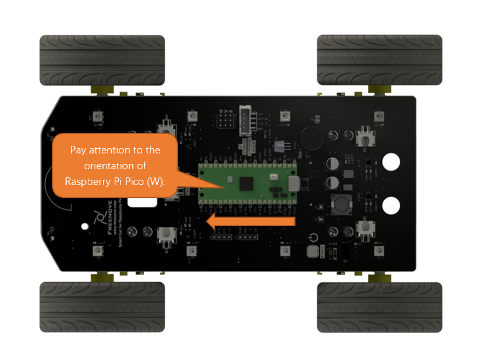

Installing Servo
===================================

Servo package: one servo, three rocker arms, two M2*8 screws and one M2*4 screw. 

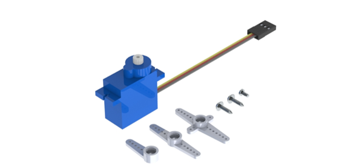

.. table::
    :align: center

    +-----------------------------------------------------------------------------------------------------------------+
    | Step 1 Fix servo1 to the shield.                                                                                |
    |                                                                                                                 |
    | |Chapter01_09|                                                                                                  |
    |                                                                                                                 |
    | Use two M2*16 screws and two M2 nuts to mount the servo1 on the shield. Pay attention to the servo's direction. |
    +-----------------------------------------------------------------------------------------------------------------+
    | Step 2 Wiring of the servor motor                                                                               |
    |                                                                                                                 |
    | Connect servo1 to P3 interfaces on the shield.                                                                  |
    |                                                                                                                 |
    | Pay attention to the color of the wires. Do not connect them wrongly.                                           |
    |                                                                                                                 |
    | |Chapter01_10|                                                                                                  |
    |                                                                                                                 |
    | Connect servo to P3 interfaces on the shield respectively.                                                      |
    |                                                                                                                 |
    | Pay attention to the color of the wires. Do not connect them wrongly.                                           |
    +-----------------------------------------------------------------------------------------------------------------+

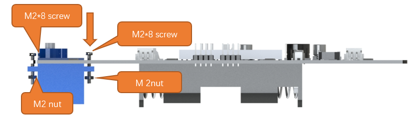
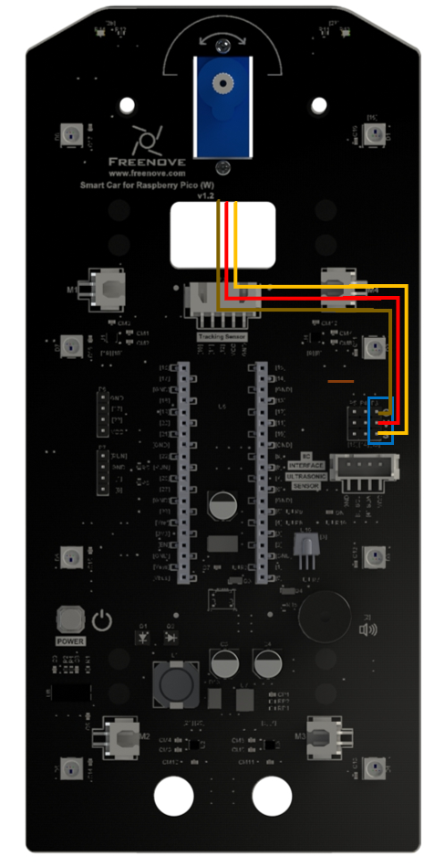

Installing Line Tracking Module
=====================================

.. table::
    :align: center

    +----------------------------------------------------------------------------------------------------------------------------------------------------------------+
    | Step 1 Installing line tracking module                                                                                                                         |
    |                                                                                                                                                                |
    | |Chapter01_11|                                                                                                                                                 |
    |                                                                                                                                                                |
    | First, use two M3*6 screws to fix two M3*30 standoffs to the bottom of the car, and then use two M3*6 screws to fix the line tracking module to the standoffs. |
    +----------------------------------------------------------------------------------------------------------------------------------------------------------------+
    | Step 2 Connect the cable to the tracking module                                                                                                                |
    |                                                                                                                                                                |
    | |Chapter01_12|                                                                                                                                                 |
    |                                                                                                                                                                |
    | Use cable to connect the two connectors marked above.                                                                                                          |
    +----------------------------------------------------------------------------------------------------------------------------------------------------------------+

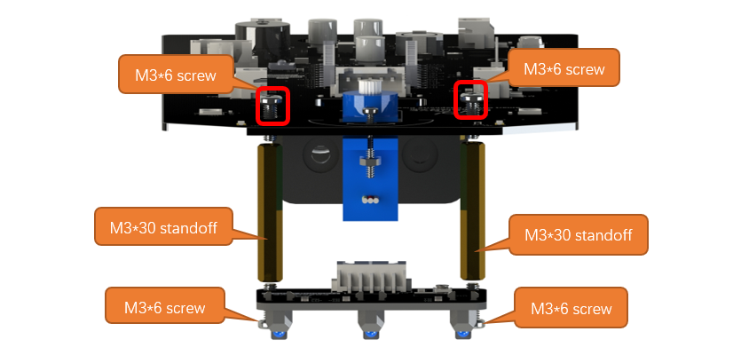
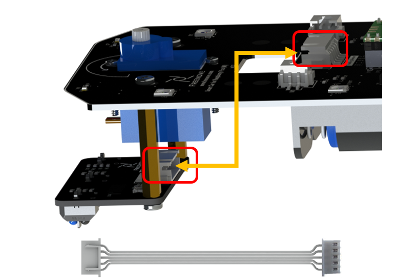

Mounting the Servo Arm to Module Connector.
=================================================

.. table::
    :align: center

    +----------------------------------------------------------------------------------------------------------------------------------------------------------------------------------------------------+
    | Step 1 Mount the servo arm to acoustic wave module or expression module connector. The screw and arm are in the same bag with servo.                                                               |
    |                                                                                                                                                                                                    |
    | |Chapter01_13|                                                                                                                                                                                     |
    +----------------------------------------------------------------------------------------------------------------------------------------------------------------------------------------------------+
    | Step 2 Connect servo arm to servo. Make sure servo is installed at 90 degrees.                                                                                                                     |
    |                                                                                                                                                                                                    |
    | Note: Before attache the rocker arm to servo, please adjust the servo at 90°.You can refer to :ref:`here <fnk0089/codes/standard/0_installation_of_arduino_ide_:how to compile and upload code>`.  |
    |                                                                                                                                                                                                    |
    | |Chapter01_14|                                                                                                                                                                                     |
    +----------------------------------------------------------------------------------------------------------------------------------------------------------------------------------------------------+
    | Step 3 Connect the two connectors marked below with a cable.                                                                                                                                       |
    |                                                                                                                                                                                                    |
    | |Chapter01_15|                                                                                                                                                                                     |
    +----------------------------------------------------------------------------------------------------------------------------------------------------------------------------------------------------+

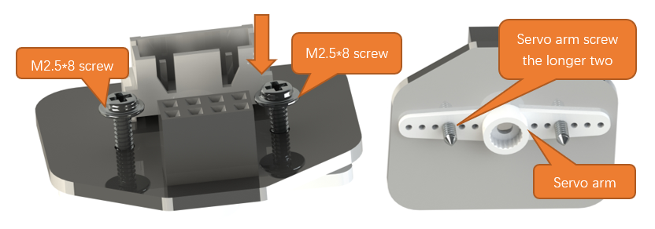
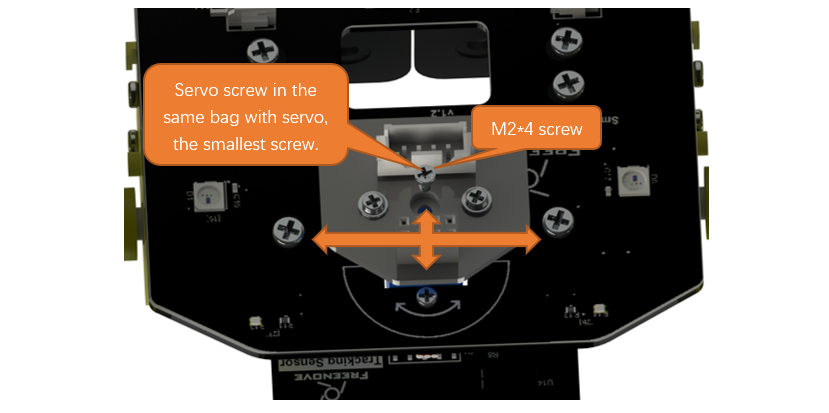
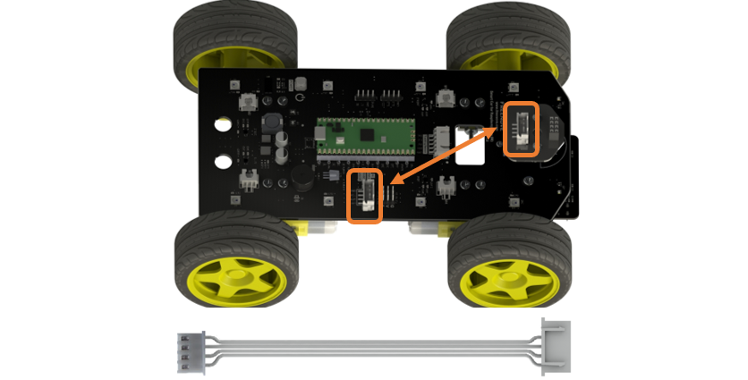

Plugging in LED Matrix or ultrasonic module
==================================================

.. table::
    :align: center

    +-------------------------------------------------+
    | Step 1 Install LED Matrix or ultrasonic module. |
    |                                                 |
    | |Chapter01_16|                                  |
    |                                                 |
    | |Chapter01_17|                                  |
    +-------------------------------------------------+

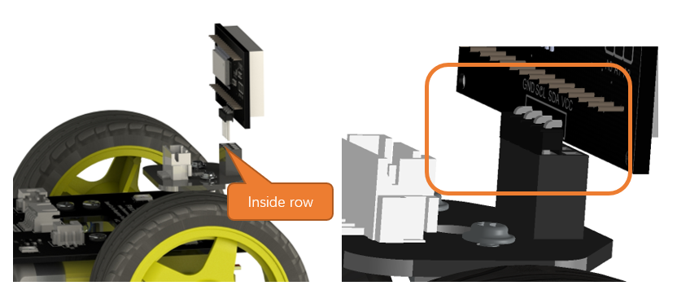
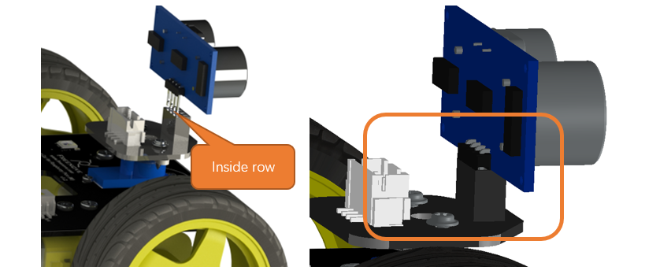

Installing two 18650 batteries
======================================

.. table::
    :align: center

    +-------------------------------------------------------------------------------------------------------+
    | Step 1 Installed with batteries. When installing them, please following the silk print on the board.  |
    |                                                                                                       |
    | |Chapter01_18|                                                                                        |
    |                                                                                                       |
    | |Chapter01_19|                                                                                        |
    +-------------------------------------------------------------------------------------------------------+

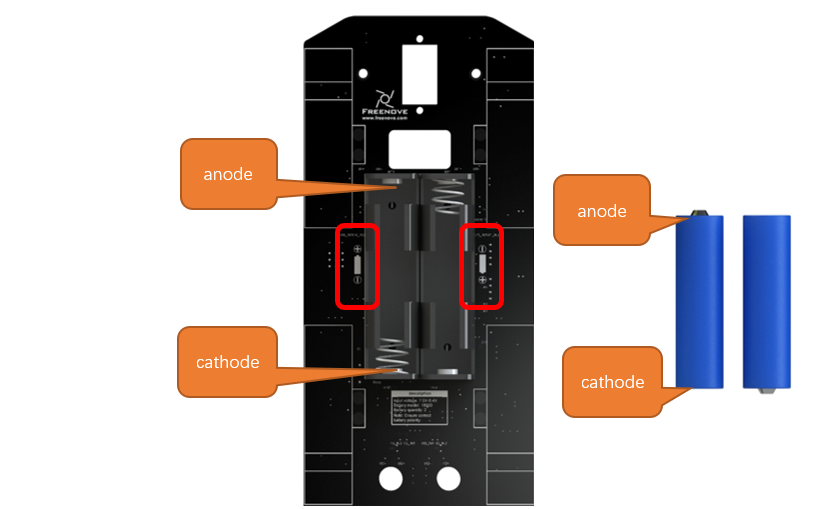
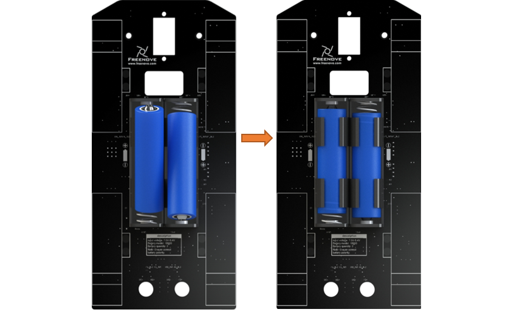

How to Play
***************************************

Add libraries
=======================================

Open the Arduino IDE, Click Sketch on the menu bar -> Include Library -> Add .ZIP Library...

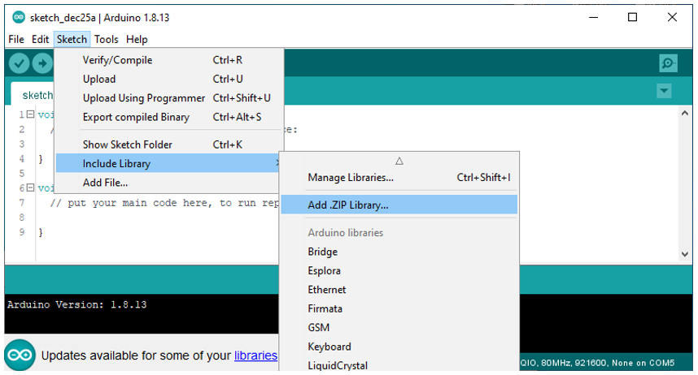

In the new pop-up window, select Freenove_4WD_Car_Kit_for_Raspberry_Pi_Pico_W\\Libraries, select every Library, click Open, and repeat this process until you have installed all six Libraries into the Arduino.

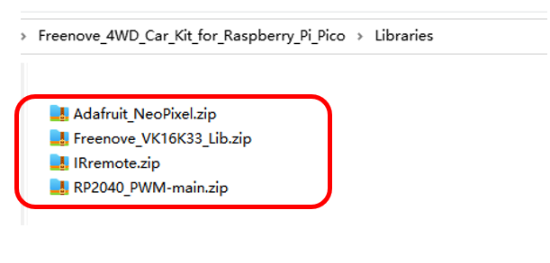