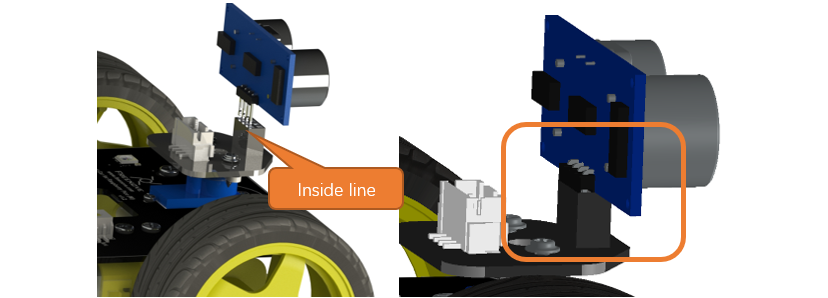
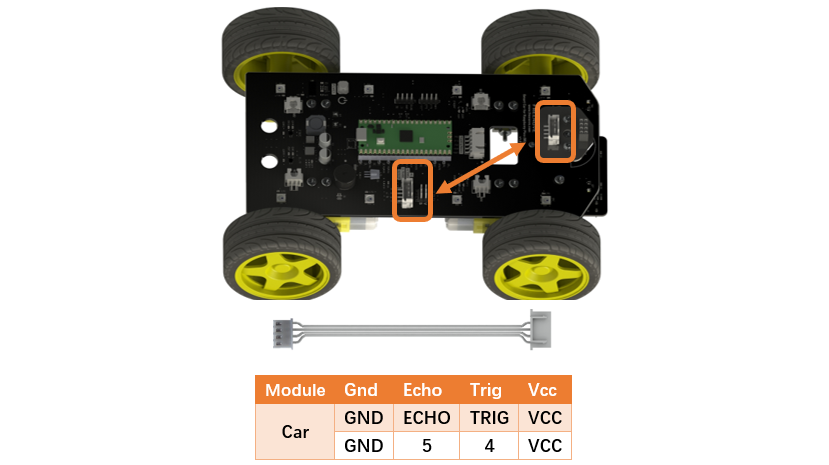
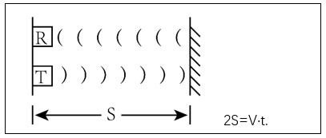
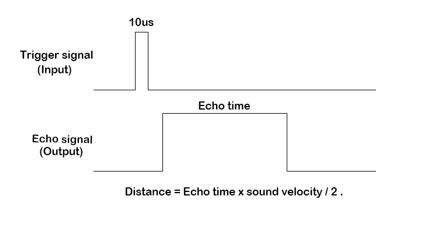
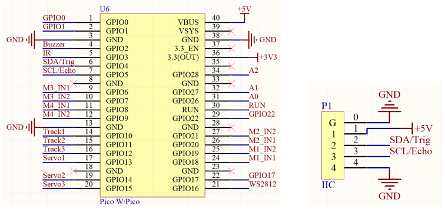
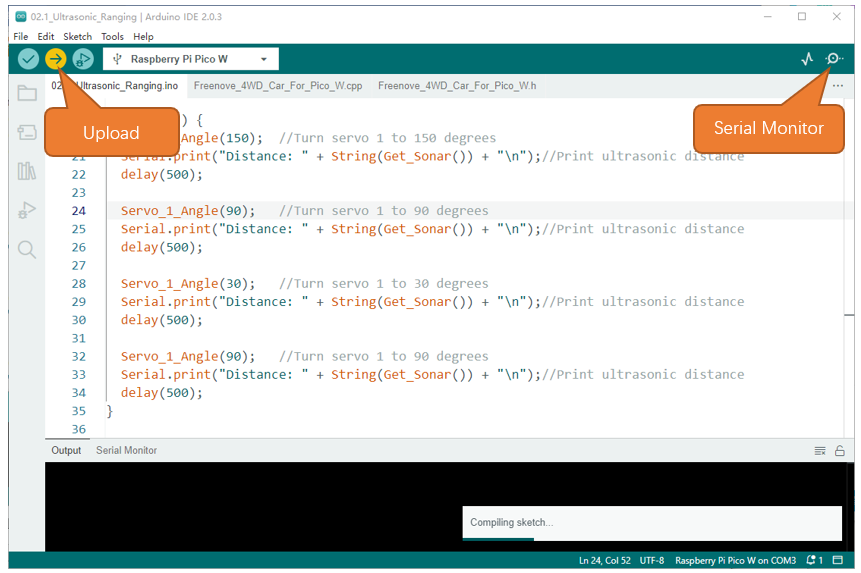
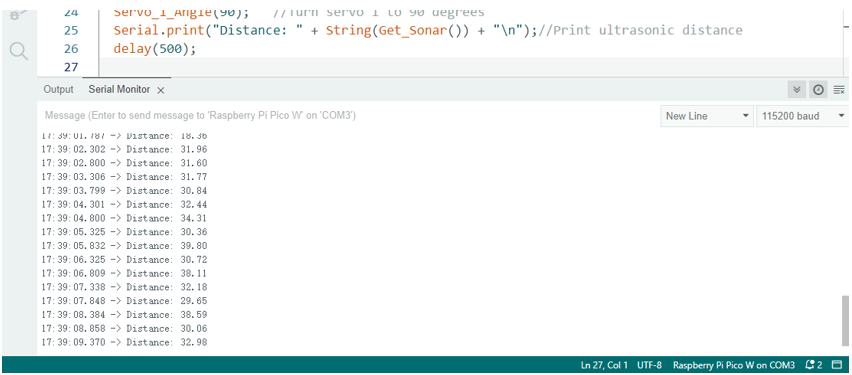
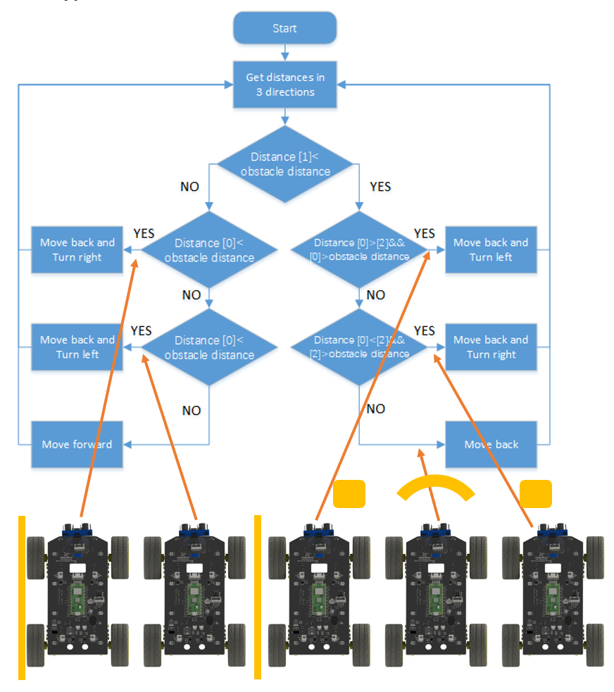

##############################################################################
Chapter 3 Ultrasonic Obstacle Avoidance Car
##############################################################################

This chapter requires replacing the LED matrix with the ultrasonic module. Please follow the tutorial to replace it first. In this tutorial, only chapters 3, 6, and 7 apply the ultrasonic module. When work on other chapters, please change to use the LED matrix.

3.1 Ultrasonic Module
***********************************

Replace the ultrasonic module.
===================================

.. table:: 
    :align: center
    :class: table-line
    :width: 90%

    +-------------------------------------------------------+
    | Step 1 Installing the ultrasonic module.              |
    |                                                       |
    | |Chapter03_00|                                        |
    +-------------------------------------------------------+
    | Use cable to connect the two connectors marked below. |
    |                                                       |
    | |Chapter03_01|                                        |
    +-------------------------------------------------------+

Ultrasonic Module
==================================

The ultrasonic ranging module uses the principle that ultrasonic waves will be sent back when encounter obstacles. We can measure the distance by counting the time interval between sending and receiving of the ultrasonic waves, and the time difference is the total time of the ultrasonic wave's journey from being transmitted to being received. Because the speed of sound in air is a constant, about v=340m/s, we can calculate the distance between the ultrasonic ranging module and the obstacle: s=vt/2.

The ultrasonic ranging module integrates both an ultrasonic transmitter and a receiver. The transmitter is used to convert electrical signals (electrical energy) into high frequency (beyond human hearing) sound waves (mechanical energy) and the function of the receiver is opposite of this. The picture and the diagram of the ultrasonic ranging module are shown below: 

.. list-table::
    :class: table-line
    :align: center

    * - |Chapter03_03| 
      - |Chapter03_04|

Pin description:

.. table:: 
    :class: freenove-ow

    +------+------------------+
    | Pin  |   Description    |
    +======+==================+
    | VCC  | Power supply pin |
    +------+------------------+
    | Trig | Trigger pin      |
    +------+------------------+
    | Echo | Echo pin         |
    +------+------------------+
    | GND  | GND              |
    +------+------------------+

**Technical specs:**

- Working voltage: 5V                              

- Working current: 12mA

- Minimum measured distance: 2cm          

- Maximum measured distance: 200cm

Instructions for use: output a high-level pulse in Trig pin lasting for least 10us, the module begins to transmit ultrasonic waves. At the same time, the Echo pin is pulled up. When the module receives the returned ultrasonic waves from encountering an obstacle, the Echo pin will be pulled down. The duration of high level in the Echo pin is the total time of the ultrasonic wave from transmitting to receiving, s=vt/2. 

Schematic
===================================

The ultrasonic module is plugged in the front of the car and is connected to the Raspberry Pi Pico (W) development board by means of wiring. As can be seen from the figure below, Raspberry Pi Pico (W) uses GPIO4 and GPIO5 to control the Trig and Echo pins of the ultrasonic module.

Sketch
===================================

When the power of the car is turned ON, every module will be initialized and the servo motor will rotate to 90°. The ultrasonic data will be obtained and printed through serial port as the servo motor rotates.

Open the folder "02.1_Ultrasonic_Ranging" in **"Freenove_4WD_Car_Kit_for_Raspberry_Pi_Pico\\Ordinary_wheels\\Sketches"** and double click **"02.1_Ultrasonic_Ranging.ino"**

Code
-----------------------------

.. literalinclude:: ../../../freenove_Kit/Ordinary_wheels/Sketches/02.1_Ultrasonic_Ranging/02.1_Ultrasonic_Ranging.ino
    :linenos:
    :language: c
    :dedent:

Code Explanation
----------------------------

Initialize ultrasonic module and Servo.

.. literalinclude:: ../../../freenove_Kit/Ordinary_wheels/Sketches/02.1_Ultrasonic_Ranging/02.1_Ultrasonic_Ranging.ino
    :linenos:
    :language: c
    :lines: 12-13
    :dedent:

Obtain the distance between ultrasonic module and the obstacle and return a real number data in cm.

.. code-block:: c
    :linenos:

    Get_Sonar()

Rotate the angle of the servo motor 1 and cooperate with the ultrasonic module to obtain distance data.

.. code-block:: c
    :linenos:

    Servo_1_Angle(150);  //Turn servo 1 to 150 degrees
    ...
    Servo_1_Angle(90);   //Turn servo 1 to 90 degrees
    ...
    Servo_1_Angle(30);   //Turn servo 1 to 30 degrees
    ...
    Servo_1_Angle(90);   //Turn servo 1 to 90 degrees

Click "Upload" to upload the code to Raspberry Pi Pico (W). After uploading successfully, open Serial Monitor.

Set the baud rate as 115200. 

3.2 Ultrasonic car
*************************************

After starting the car, the ultrasound acquires data in various directions, makes judgments based on the data in each direction, and controls the car to avoid obstacles.

Sketch
=====================================

Open the folder "02.2_Ultrasonic_Ranging_Car"in 

**"Freenove_4WD_Car_Kit_for_Raspberry_Pi_Pico\\Ordinary_wheels\\Sketches"** and double click 

"02.2_Ultrasonic_Ranging_Car.ino".

Code
-------------------------------------

.. literalinclude:: ../../../freenove_Kit/Ordinary_wheels/Sketches/02.2_Ultrasonic_Ranging_Car/02.2_Ultrasonic_Ranging_Car.ino
    :linenos:
    :language: c
    :dedent:

The code of automatic obstacle avoidance vehicle is as follows:

.. literalinclude:: ../../../freenove_Kit/Ordinary_wheels/Sketches/02.2_Ultrasonic_Ranging_Car/Freenove_4WD_Car_For_Pico_W.cpp
    :linenos:
    :language: c
    :lines: 228-281 
    :dedent:

Code Explanation
--------------------------------------

The PWM value represents different speeds when the voltage of battery changes, so we set a speedOffset to compensate the difference.

.. code-block:: c
    :linenos:

    void oa_CalculateVoltageCompensation() {
        Get_Battery_Voltage();
        float voltageOffset = BAT_VOL_STANDARD - batteryVoltage;
        oa_VoltageCompensationToSpeed = voltageOffset * OA_SPEED_OFFSET_PER_V;
    }

OA SPEED OFFSET PER V: The default value is three, which is a tested value. You can try to test what is the most proper value.

We need control servo to 150°, 90°, 30°, 90°, 150°…

Get one ultrasonic module value (distance) at one angle.

.. literalinclude:: ../../../freenove_Kit/Ordinary_wheels/Sketches/02.2_Ultrasonic_Ranging_Car/Freenove_4WD_Car_For_Pico_W.cpp
    :linenos:
    :language: c
    :lines: 254-280
    :dedent:

Code logic is as shown in the flow chart below:

Distance[0] is the distance to obstacle at the left.

Distance[1] is the distance to obstacle at the center. 

Distance[2] is the distance to obstacle at the left.

This project can be referred to as follows:

