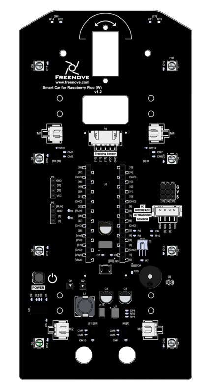
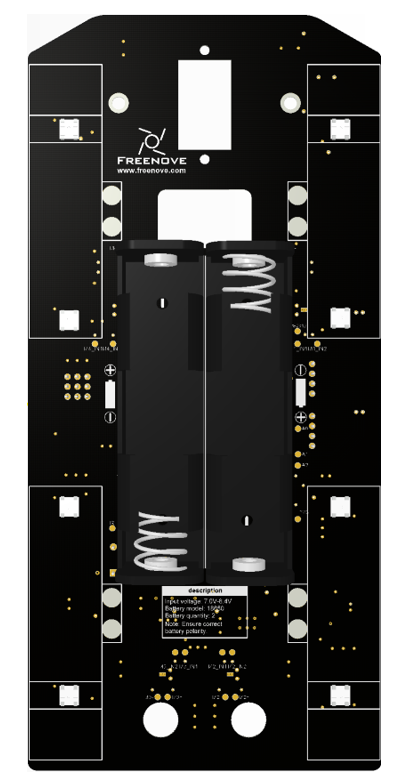

##############################################################################
List
##############################################################################

If you have any concerns, please feel free to contact us via support@freenove.com

Raspberry Pi Pico (W) Car Shield
********************************************

.. list-table::
   :widths: 50 50
   :header-rows: 1
   :align: center
   :width: 90%
   :class: table-line

   * - Top
     - Bottom
   * - |List00|
     - |List01|

Machinery Parts
********************************************

.. list-table::
   :align: center
   :width: 90%
   :class: table-line

   * - |List02|
     - |List03|
     - |List04|
     - |List05|

Transmission Parts
********************************************

.. table:: 
    :align: center
    :width: 90%
    :class: table-line

    +-------------------------------------------------------------+---------------------------+
    | Servo package x1                                            | Driven wheel x4           |
    |                                                             |                           |
    | |List06|                                                    | |List08|                  |
    +-------------------------------------------------------------+---------------------------+
    | DC speed reduction motor x4                                 | Motor bracket package  x4 |
    |                                                             |                           |
    | |List07|                                                    | |List09|                  |
    |                                                             |                           |
    | :red:`Caution: Do not remove the cable tie from the motor;` |                           |
    |                                                             |                           |
    | :red:`otherwise, the motor cable may become detached.`      |                           |
    +-------------------------------------------------------------+---------------------------+

Electronic Parts
*********************************************

.. table:: 
    :align: center
    :width: 90%
    :class: table-line

    +-------------------------+-------------------------+-----------------------------+
    | Line tracking module x1 | Dot Matrix Module x1    | Ultrasonic Module x1        |
    |                         |                         |                             |
    | |List10|                | |List11|                | |List12|                    |
    +                         +                         +-----------------------------+
    |                         |                         | Ultrasonic module connector |
    |                         |                         |                             |
    |                         |                         | |List13|                    |
    +-------------------------+-------------------------+-----------------------------+
    | Raspberry Pi Pico W x1 or Raspberry Pi Pico x1    | Infrared emitter x1         |
    |                                                   |                             |
    | |List14|                                          | |List15|                    |
    +-------------------------+-------------------------+-----------------------------+

.. |List10| image:: ../_static/imgs/Standard/List/List10.png

Wires
********************************************

.. list-table::
   :align: center
   :width: 90%
   :class: table-line

   * - XH-2.54-4Pin cable x1
   * - |List16|
   
   * - XH-2.54-5Pin cable x1
   * - |List17|
  

Tools
********************************************

.. list-table::
   :header-rows: 1
   :align: center
   :width: 90%
   :class: table-line

   * - Cross screwdriver (3mm) x1
     - Black tape x1

   * - |List18|
     - |List19|

Required but NOT Contained Parts
*********************************************

.. table:: 
    :align: center
    :width: 90%
    :class: table-line

    +-------------------------------------------------------------------------------------------------+
    | 2 x 3.7V 18650 lithium rechargeable batteries with continuous discharge current > 3A.           |
    |                                                                                                 |
    | **It is easier to find proper battery on eBay than Amazon. Search "18650 high drain" on eBay.** |
    |                                                                                                 |
    | |List20|                                                                                        |
    +-------------------------------------------------------------------------------------------------+

